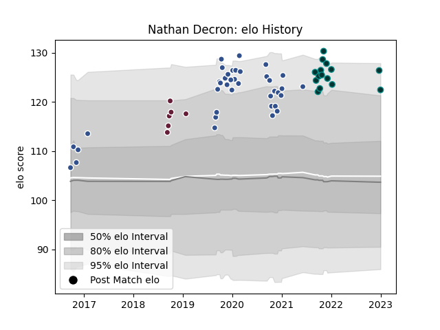

---  
layout: page  
title: Nathan Decron  
date: 2022-12-18 16:24:50.059144  
categories: player  
---
# Nathan Decron

## Positions: C

## Current elo: 116.0

## Current Percentile: 88.0

# Elo History

# Match History

| Team            |   Appearances |   Win Rate |
|:----------------|--------------:|-----------:|
| Agen            |            36 |   0.263889 |
| Pau             |            14 |   0.535714 |
| Bordeaux Begles |             6 |   0.416667 |

| Opponent             |   Matches |   Win Rate |
|:---------------------|----------:|-----------:|
| Castres Olympique    |         5 |   0        |
| Clermont Auvergne    |         5 |   0.2      |
| Lyon                 |         5 |   0.2      |
| La Rochelle          |         4 |   0.25     |
| Brive                |         4 |   0.75     |
| Montpellier Herault  |         4 |   0.625    |
| Toulon               |         3 |   0.166667 |
| Stade Toulousain     |         3 |   0        |
| Stade Francais Paris |         3 |   0.666667 |
| Bordeaux Begles      |         2 |   0        |
| Bourgoin-Jallieu     |         2 |   1        |
| Racing 92            |         2 |   0.25     |
| Perpignan            |         2 |   1        |
| Bayonne              |         2 |   0.5      |
| Narbonne             |         1 |   0        |
| Pau                  |         1 |   0        |
| Agen                 |         1 |   0        |
| Mont-de-Marsan       |         1 |   1        |
| Grenoble             |         1 |   0        |
| Edinburgh            |         1 |   0        |
| Dragons              |         1 |   1        |
| Connacht             |         1 |   0        |
| Biarritz Olympique   |         1 |   1        |
| Wasps                |         1 |   0        |