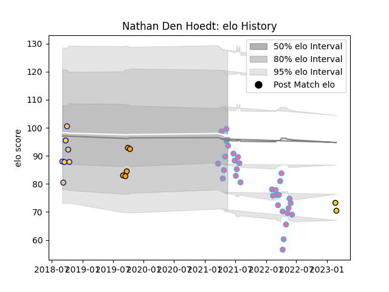

---  
layout: page  
title: Nathan Den Hoedt  
date: 2023-03-02 11:20:59.611499  
categories: player  
---
# Nathan Den Hoedt

## Positions: L, FL

## Current elo: 96.0

## Current Percentile: 48.0

# Elo History

# Match History

| Team               |   Appearances |   Win Rate |
|:-------------------|--------------:|-----------:|
| L. A. Giltinis     |            33 |   0.727273 |
| Brisbane City      |             7 |   0.571429 |
| NSW Country Eagles |             5 |   0.5      |
| Houston SaberCats  |             2 |   1        |

| Opponent               |   Matches |   Win Rate |
|:-----------------------|----------:|-----------:|
| Utah Warriors          |         5 |   0.6      |
| Austin Gilgronis       |         4 |   0.75     |
| San Diego Legion       |         4 |   0.75     |
| Dallas Jackals         |         3 |   1        |
| Houston SaberCats      |         3 |   0.666667 |
| Seattle Seawolves      |         3 |   0.666667 |
| R.U. New York          |         2 |   0.5      |
| Toronto Arrows         |         2 |   1        |
| Sydney Rays            |         2 |   1        |
| Rugby New York         |         2 |   0.5      |
| Rugby ATL              |         2 |   1        |
| Western Force          |         2 |   0.5      |
| New England Free Jacks |         2 |   1        |
| NOLA Gold              |         2 |   0.5      |
| Fijian Drua            |         2 |   0.25     |
| Canberra Vikings       |         2 |   0        |
| Queensland Country     |         1 |   1        |
| Brisbane City          |         1 |   0        |
| NSW Country Eagles     |         1 |   1        |
| Melbourne Rising       |         1 |   1        |
| Old Glory DC           |         1 |   1        |