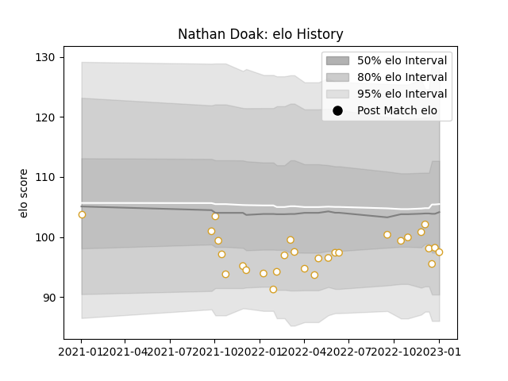

---  
layout: page  
title: Nathan Doak  
date: 2023-01-06 00:13:06.019987  
categories: player  
---
# Nathan Doak

## Positions: SH

## Current elo: 97.0

## Current Percentile: 28.0

# Elo History

# Match History

| Team   |   Appearances |   Win Rate |
|:-------|--------------:|-----------:|
| Ulster |            29 |   0.655172 |

| Opponent         |   Matches |   Win Rate |
|:-----------------|----------:|-----------:|
| Munster          |         6 |   0.5      |
| Connacht         |         4 |   0.75     |
| Leinster         |         3 |   0.666667 |
| Lions            |         2 |   1        |
| Zebre            |         2 |   1        |
| Edinburgh        |         1 |   1        |
| Glasgow Warriors |         1 |   1        |
| La Rochelle      |         1 |   0        |
| Bulls            |         1 |   0        |
| Dragons          |         1 |   1        |
| Cardiff Blues    |         1 |   1        |
| Ospreys          |         1 |   0        |
| Sale Sharks      |         1 |   0        |
| Scarlets         |         1 |   1        |
| Sharks           |         1 |   1        |
| Stormers         |         1 |   0        |
| Benetton Treviso |         1 |   1        |