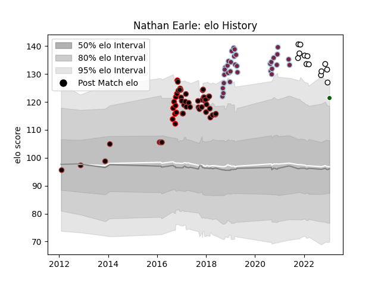

---  
layout: page  
title: Nathan Earle  
date: 2022-11-15 23:41:23.046359  
categories: player  
---
# Nathan Earle

## Positions: W

## Current elo: 121.0

## Current Percentile: 94.0

# Elo History

# Match History

| Team              |   Appearances |   Win Rate |
|:------------------|--------------:|-----------:|
| Saracens          |            45 |   0.644444 |
| Harlequins        |            34 |   0.529412 |
| Newcastle Falcons |            11 |   0.272727 |
| Canterbury        |            10 |   0.9      |

| Opponent           |   Matches |   Win Rate |
|:-------------------|----------:|-----------:|
| Leicester Tigers   |        10 |   0.5      |
| Sale Sharks        |        10 |   0.75     |
| Northampton Saints |        10 |   0.6      |
| Exeter Chiefs      |         8 |   0.5      |
| Gloucester Rugby   |         7 |   0.428571 |
| Newcastle Falcons  |         7 |   1        |
| Bath Rugby         |         6 |   0.333333 |
| Wasps              |         5 |   0.8      |
| Saracens           |         5 |   0        |
| Worcester Warriors |         4 |   0.75     |
| London Irish       |         3 |   1        |
| Harlequins         |         3 |   0        |
| Bristol Rugby      |         3 |   0.333333 |
| Counties Manukau   |         2 |   0.5      |
| Clermont Auvergne  |         2 |   0        |
| Scarlets           |         2 |   0.75     |
| Tasman             |         2 |   1        |
| Agen               |         2 |   1        |
| Hawke's Bay        |         1 |   1        |
| Auckland           |         1 |   1        |
| Grenoble           |         1 |   0        |
| North Harbour      |         1 |   1        |
| Otago              |         1 |   1        |
| Taranaki           |         1 |   1        |
| Toulon             |         1 |   1        |
| Waikato            |         1 |   1        |
| Benetton Treviso   |         1 |   0        |