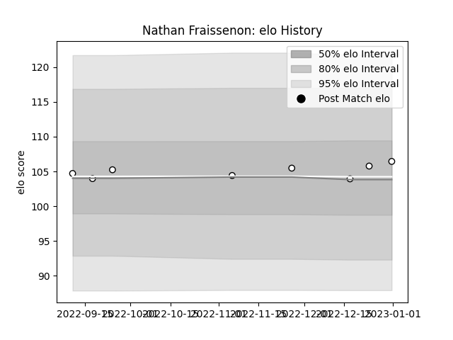

---  
layout: page  
title: Nathan Fraissenon  
date: 2022-12-18 16:38:55.119028  
categories: player  
---
# Nathan Fraissenon

## Positions: P

## Current elo: 97.0

## Current Percentile: 63.0

# Elo History

# Match History

| Team   |   Appearances |   Win Rate |
|:-------|--------------:|-----------:|
| Brive  |             6 |   0.166667 |

| Opponent            |   Matches |   Win Rate |
|:--------------------|----------:|-----------:|
| Castres Olympique   |         1 |          0 |
| Connacht            |         1 |          0 |
| La Rochelle         |         1 |          0 |
| Montpellier Herault |         1 |          0 |
| Pau                 |         1 |          0 |
| Perpignan           |         1 |          1 |