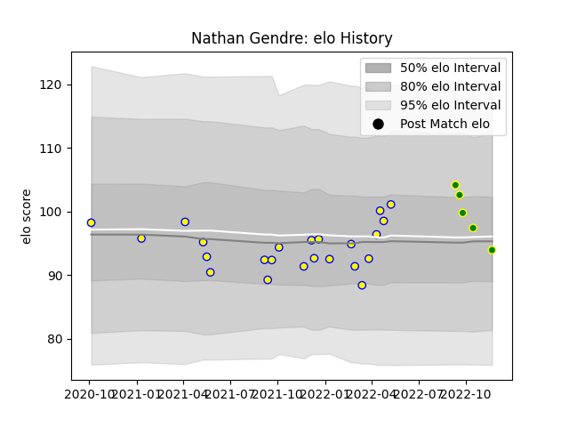

---  
layout: page  
title: Nathan Gendre  
date: 2022-11-22 11:35:31.617031  
categories: player  
---
# Nathan Gendre

## Positions: L

## Current elo: 94.0

## Current Percentile: 59.0

# Elo History

# Match History

| Team                |   Appearances |   Win Rate |
|:--------------------|--------------:|-----------:|
| Aubenas             |            23 |    0.26087 |
| Carqueiranne-Hyères |             5 |    0.2     |

| Opponent                   |   Matches |   Win Rate |
|:---------------------------|----------:|-----------:|
| Albi                       |         3 |   0.333333 |
| Cognac Saint Jean d'Angély |         3 |   0.666667 |
| Tarbes                     |         3 |   0.333333 |
| Bourgoin-Jallieu           |         2 |   0.5      |
| Chambery                   |         2 |   0        |
| Dax                        |         2 |   0.5      |
| Soyaux-Angouleme           |         2 |   0        |
| Suresnes                   |         2 |   0        |
| US Bressane                |         2 |   0        |
| Valence Romans Drome Rugby |         2 |   0        |
| Blagnac                    |         1 |   0        |
| Dijon                      |         1 |   0        |
| Narbonne                   |         1 |   1        |
| Nice                       |         1 |   0        |
| Rennes                     |         1 |   0        |