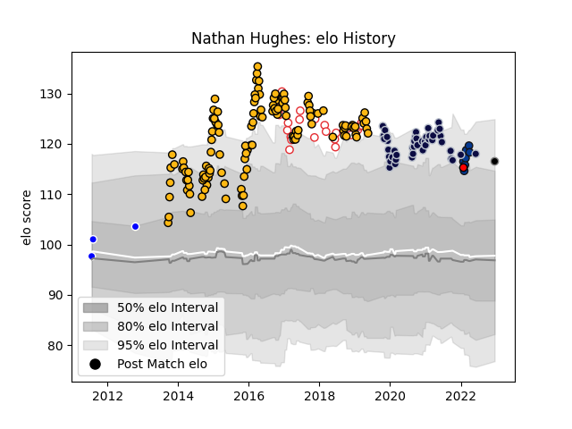

---  
layout: page  
title: Nathan Hughes  
date: 2023-01-13 11:30:22.435749  
categories: player  
---
# Nathan Hughes

## Positions: N8

## Country: England

## Current elo: 116.0

## Current Percentile: 85.0

# Elo History

# Match History

| Team             |   Appearances |   Win Rate |
|:-----------------|--------------:|-----------:|
| Wasps            |           124 |   0.584677 |
| Bristol Rugby    |            45 |   0.666667 |
| England          |            22 |   0.75     |
| Bath Rugby       |             7 |   0.357143 |
| Auckland         |             4 |   1        |
| Black Rams Tokyo |             3 |   0.333333 |
| Hartpury College |             1 |   0.5      |

| Opponent                  |   Matches |   Win Rate |
|:--------------------------|----------:|-----------:|
| Bath Rugby                |        18 |   0.5      |
| Harlequins                |        18 |   0.555556 |
| Exeter Chiefs             |        16 |   0.375    |
| Saracens                  |        15 |   0.2      |
| Northampton Saints        |        13 |   0.769231 |
| Gloucester Rugby          |        13 |   0.769231 |
| Leicester Tigers          |        13 |   0.538462 |
| Sale Sharks               |        12 |   0.458333 |
| Newcastle Falcons         |        10 |   0.95     |
| Worcester Warriors        |         9 |   1        |
| London Irish              |         6 |   0.75     |
| Leinster                  |         6 |   0.416667 |
| Wasps                     |         5 |   0.2      |
| South Africa              |         4 |   0.5      |
| Scotland                  |         3 |   0.5      |
| Stade Toulousain          |         3 |   0.5      |
| Argentina                 |         3 |   1        |
| Zebre                     |         3 |   0.833333 |
| Australia                 |         3 |   1        |
| France                    |         3 |   0.666667 |
| Castres Olympique         |         2 |   1        |
| Ireland                   |         2 |   0.5      |
| North Harbour             |         2 |   1        |
| Connacht                  |         2 |   0.5      |
| Italy                     |         2 |   1        |
| Bristol Rugby             |         2 |   1        |
| Stade Francais Paris      |         2 |   1        |
| Toshiba Brave Lupus Tokyo |         1 |   0        |
| Wellington                |         1 |   1        |
| Bayonne                   |         1 |   1        |
| Wales                     |         1 |   1        |
| Ulster                    |         1 |   0        |
| Toyota Verblitz           |         1 |   1        |
| Toulon                    |         1 |   1        |
| La Rochelle               |         1 |   1        |
| Bordeaux Begles           |         1 |   1        |
| Dragons                   |         1 |   1        |
| Otago                     |         1 |   1        |
| Fiji                      |         1 |   1        |
| Mitsubishi Dynaboars      |         1 |   0        |
| London Welsh              |         1 |   1        |
| Arix Viadana              |         1 |   1        |
| London Scottish           |         1 |   0.5      |