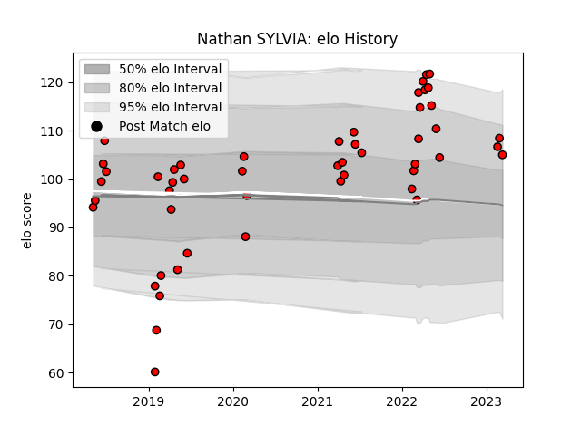

---  
layout: page  
title: Nathan SYLVIA  
date: 2023-03-28 18:12:25.836851  
categories: player  
---
# Nathan SYLVIA

Last updated: 2023-03-28
## Positions: P

## Current elo: 107.0

## Current Percentile: 78.0

# Elo History

# Match History

| Team             |   Appearances |   Win Rate |
|:-----------------|--------------:|-----------:|
| San Diego Legion |            51 |   0.588235 |

| Opponent               |   Matches |   Win Rate |
|:-----------------------|----------:|-----------:|
| Seattle Seawolves      |         8 |   0.375    |
| Utah Warriors          |         6 |   0.833333 |
| Houston SaberCats      |         5 |   0.6      |
| Austin Elite Rugby     |         3 |   1        |
| Austin Gilgronis       |         3 |   0.333333 |
| Dallas Jackals         |         3 |   1        |
| Glendale Raptors       |         3 |   0.666667 |
| NOLA Gold              |         3 |   1        |
| R.U. New York          |         3 |   0.333333 |
| Rugby ATL              |         3 |   0.333333 |
| L. A. Giltinis         |         2 |   0        |
| New England Free Jacks |         2 |   1        |
| Old Glory DC           |         2 |   0.5      |
| Rugby New York         |         2 |   0        |
| Toronto Arrows         |         2 |   0.5      |
| Colorado Raptors       |         1 |   1        |