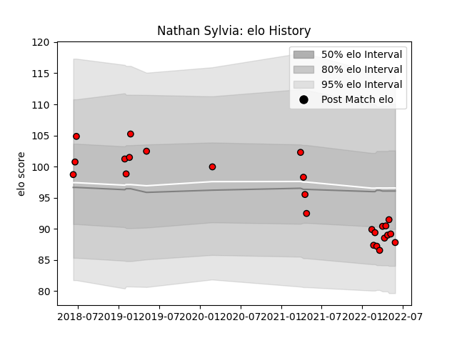

---  
layout: page  
title: Nathan Sylvia  
date: 2022-11-22 11:32:58.620180  
categories: player  
---
# Nathan Sylvia

## Positions: P

## Current elo: 88.0

## Current Percentile: 22.0

# Elo History

# Match History

| Team             |   Appearances |   Win Rate |
|:-----------------|--------------:|-----------:|
| San Diego Legion |            25 |       0.56 |

| Opponent               |   Matches |   Win Rate |
|:-----------------------|----------:|-----------:|
| Austin Gilgronis       |         3 |   0.333333 |
| Houston SaberCats      |         3 |   0.333333 |
| Seattle Seawolves      |         3 |   0.333333 |
| Utah Warriors          |         3 |   1        |
| Austin Elite Rugby     |         2 |   1        |
| Dallas Jackals         |         2 |   1        |
| L. A. Giltinis         |         2 |   0        |
| Glendale Raptors       |         1 |   1        |
| NOLA Gold              |         1 |   1        |
| New England Free Jacks |         1 |   1        |
| Old Glory DC           |         1 |   1        |
| R.U. New York          |         1 |   0        |
| Rugby ATL              |         1 |   0        |
| Toronto Arrows         |         1 |   0        |