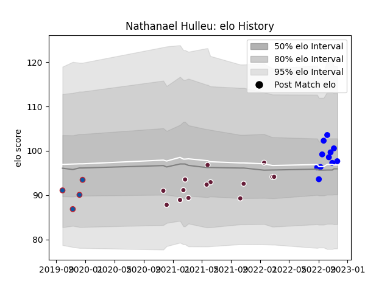

---  
layout: page  
title: Nathanael Hulleu  
date: 2023-02-02 19:03:55.795568  
categories: player  
---
# Nathanael Hulleu

## Positions: W

## Current elo: 93.0

## Current Percentile: 39.0

# Elo History

# Match History

| Team            |   Appearances |   Win Rate |
|:----------------|--------------:|-----------:|
| Vannes          |            18 |   0.472222 |
| Bordeaux Begles |            14 |   0.571429 |
| Grenoble        |             5 |   0.6      |

| Opponent             |   Matches |   Win Rate |
|:---------------------|----------:|-----------:|
| Agen                 |         3 |   0.333333 |
| Massy                |         2 |   0.5      |
| Stade Francais Paris |         2 |   0.5      |
| Rouen                |         2 |   0.5      |
| Racing 92            |         2 |   0        |
| Oyonnax              |         2 |   0.5      |
| Nevers               |         2 |   0.5      |
| Mont-de-Marsan       |         2 |   0        |
| Montpellier Herault  |         2 |   1        |
| Biarritz Olympique   |         2 |   0.5      |
| Beziers              |         2 |   1        |
| Stade Toulousain     |         2 |   0        |
| Grenoble             |         1 |   1        |
| Colomiers            |         1 |   1        |
| Montauban            |         1 |   0.5      |
| Aurillac             |         1 |   0        |
| Clermont Auvergne    |         1 |   1        |
| Carcassonne          |         1 |   1        |
| Pau                  |         1 |   1        |
| Perpignan            |         1 |   1        |
| Provence Rugby       |         1 |   1        |
| Brive                |         1 |   0        |
| Scarlets             |         1 |   1        |
| Soyaux-Angouleme     |         1 |   0        |