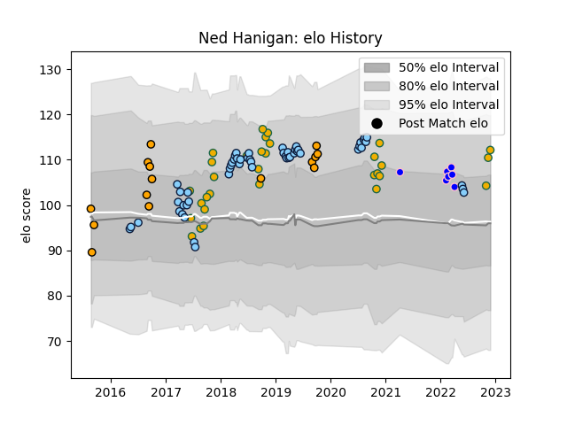

---  
layout: page  
title: Ned Hanigan  
date: 2023-03-21 18:09:41.236276  
categories: player  
---
# Ned Hanigan

Last updated: 2023-03-21
## Positions: FL, L

## Country: Australia

## Current elo: 112.0

## Current Percentile: 81.0

# Elo History

# Match History

| Team                     |   Appearances |   Win Rate |
|:-------------------------|--------------:|-----------:|
| New South Wales Waratahs |            54 |   0.453704 |
| Australia                |            31 |   0.435484 |
| NSW Country Eagles       |            15 |   0.7      |
| Kurita Water Gush        |             7 |   0.142857 |

| Opponent                         |   Matches |   Win Rate |
|:---------------------------------|----------:|-----------:|
| New Zealand                      |         9 |   0.222222 |
| Melbourne Rebels                 |         7 |   0.857143 |
| Argentina                        |         6 |   0.583333 |
| Brumbies                         |         6 |   0.166667 |
| Queensland Reds                  |         6 |   0.833333 |
| Sunwolves                        |         5 |   0.8      |
| Highlanders                      |         4 |   0.5      |
| South Africa                     |         4 |   0.5      |
| Blues                            |         4 |   0        |
| Western Force                    |         4 |   0.75     |
| Lions                            |         3 |   0        |
| Wales                            |         3 |   0.666667 |
| Crusaders                        |         3 |   0.333333 |
| Jaguares                         |         3 |   0        |
| Chiefs                           |         2 |   0        |
| Sydney Rays                      |         2 |   1        |
| Brisbane City                    |         2 |   0.5      |
| Bulls                            |         2 |   0.5      |
| Scotland                         |         2 |   0.5      |
| Canberra Vikings                 |         2 |   0.5      |
| Queensland Country               |         2 |   0        |
| Munakata Sanix Blues             |         2 |   0        |
| England                          |         2 |   0        |
| Hurricanes                       |         2 |   0        |
| Italy                            |         2 |   0.5      |
| Chugoku Red Regulions            |         2 |   0.5      |
| Melbourne Rising                 |         1 |   1        |
| Southern Kings                   |         1 |   0        |
| Fijian Drua                      |         1 |   0.5      |
| Toyota Industries Shuttles Aichi |         1 |   0        |
| Sydney Stars                     |         1 |   1        |
| Greater Sydney Rams              |         1 |   1        |
| Stormers                         |         1 |   1        |
| Shimizu Blue Sharks              |         1 |   0        |
| Ireland                          |         1 |   0        |
| Sharks                           |         1 |   0.5      |
| Japan                            |         1 |   1        |
| Kamaishi Seawaves                |         1 |   0        |
| Perth Spirit                     |         1 |   1        |
| Fiji                             |         1 |   1        |
| Cheetahs                         |         1 |   1        |
| North Harbour Rays               |         1 |   1        |