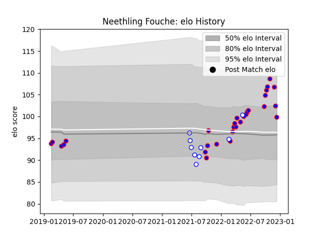

---  
layout: page  
title: Neethling Fouche  
date: 2022-12-18 16:19:30.994821  
categories: player  
---
# Neethling Fouche

## Positions: P

## Current elo: 100.0

## Current Percentile: 74.0

# Elo History

# Match History

| Team             |   Appearances |   Win Rate |
|:-----------------|--------------:|-----------:|
| Stormers         |            29 |   0.672414 |
| Western Province |             9 |   0.555556 |

| Opponent            |   Matches |   Win Rate |
|:--------------------|----------:|-----------:|
| Edinburgh           |         3 |   0.833333 |
| Bulls               |         3 |   0.666667 |
| Lions               |         3 |   0.666667 |
| Golden Lions        |         2 |   0.5      |
| Ulster              |         2 |   1        |
| Scarlets            |         2 |   1        |
| Ospreys             |         2 |   0.75     |
| Natal Sharks        |         2 |   1        |
| Blue Bulls          |         2 |   0.5      |
| Zebre               |         2 |   1        |
| Dragons             |         2 |   1        |
| Connacht            |         2 |   0.5      |
| Free State Cheetahs |         1 |   0        |
| Griquas             |         1 |   0        |
| Jaguares            |         1 |   0        |
| Leinster            |         1 |   1        |
| Crusaders           |         1 |   0.5      |
| Munster             |         1 |   0        |
| Clermont Auvergne   |         1 |   0        |
| Pumas               |         1 |   1        |
| Cardiff Blues       |         1 |   1        |
| Brumbies            |         1 |   0        |
| Benetton Treviso    |         1 |   0        |