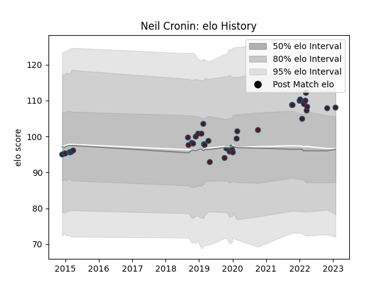

---  
layout: page  
title: Neil Cronin  
date: 2023-02-02 19:03:50.253692  
categories: player  
---
# Neil Cronin

## Positions: SH

## Current elo: 108.0

## Current Percentile: 78.0

# Elo History

# Match History

| Team    |   Appearances |   Win Rate |
|:--------|--------------:|-----------:|
| Munster |            42 |   0.666667 |

| Opponent         |   Matches |   Win Rate |
|:-----------------|----------:|-----------:|
| Connacht         |         6 |   0.666667 |
| Ulster           |         5 |   0.4      |
| Glasgow Warriors |         4 |   0.5      |
| Scarlets         |         4 |   0.625    |
| Benetton Treviso |         3 |   1        |
| Ospreys          |         3 |   0.666667 |
| Southern Kings   |         3 |   1        |
| Zebre            |         3 |   1        |
| Dragons          |         2 |   1        |
| Edinburgh        |         2 |   0.5      |
| Leinster         |         2 |   0.5      |
| Bulls            |         1 |   0        |
| Cardiff Blues    |         1 |   1        |
| Cheetahs         |         1 |   1        |
| Exeter Chiefs    |         1 |   0.5      |
| Lions            |         1 |   0        |