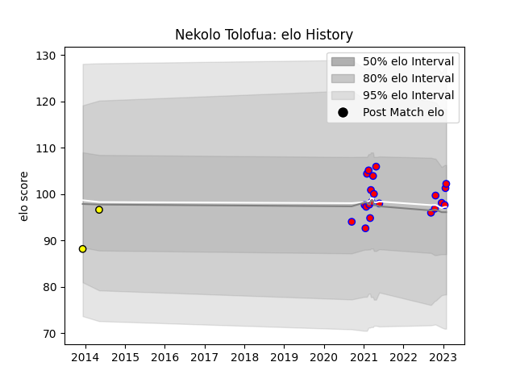

---  
layout: page  
title: Nekolo Tolofua  
date: 2023-02-02 19:04:08.538305  
categories: player  
---
# Nekolo Tolofua

## Positions: C

## Current elo: 102.0

## Current Percentile: 65.0

# Elo History

# Match History

| Team        |   Appearances |   Win Rate |
|:------------|--------------:|-----------:|
| Blagnac     |            21 |   0.452381 |
| Carcassonne |             2 |   0        |

| Opponent                   |   Matches |   Win Rate |
|:---------------------------|----------:|-----------:|
| US Bressane                |         3 |   0.333333 |
| Albi                       |         2 |   0.5      |
| Aubenas                    |         2 |   0.5      |
| Cognac Saint Jean d'Angély |         2 |   1        |
| Dax                        |         2 |   0.5      |
| Massy                      |         2 |   0.5      |
| Tarbes                     |         2 |   0.25     |
| Valence Romans Drome Rugby |         2 |   0.5      |
| Bourgoin-Jallieu           |         1 |   0        |
| Dijon                      |         1 |   0        |
| La Rochelle                |         1 |   0        |
| Narbonne                   |         1 |   0        |
| Pau                        |         1 |   0        |
| Suresnes                   |         1 |   1        |