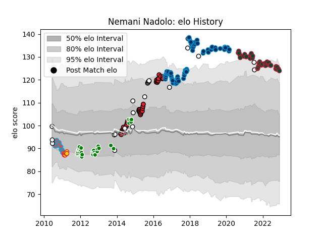

---  
layout: page  
title: Nemani Nadolo  
date: 2023-03-21 18:14:44.163285  
categories: player  
---
# Nemani Nadolo

Last updated: 2023-03-21
## Positions: W

## Country: Fiji

## Current elo: 124.0

## Current Percentile: 93.0

# Elo History

# Match History

| Team                     |   Appearances |   Win Rate |
|:-------------------------|--------------:|-----------:|
| Montpellier Herault      |            70 |  0.642857  |
| Leicester Tigers         |            42 |  0.738095  |
| Crusaders                |            39 |  0.717949  |
| Green Rockets Tokatsu    |            31 |  0.516129  |
| Fiji                     |            23 |  0.478261  |
| Bourgoin-Jallieu         |            15 |  0.0666667 |
| Exeter Chiefs            |             6 |  0.166667  |
| New South Wales Waratahs |             3 |  0         |

| Opponent                          |   Matches |   Win Rate |
|:----------------------------------|----------:|-----------:|
| Northampton Saints                |         9 |   0.777778 |
| Stade Toulousain                  |         7 |   0.142857 |
| Castres Olympique                 |         7 |   0.428571 |
| Pau                               |         7 |   0.857143 |
| Lyon                              |         6 |   0.5      |
| La Rochelle                       |         6 |   0.333333 |
| Toulon                            |         6 |   0.5      |
| Stade Francais Paris              |         6 |   0.5      |
| Clermont Auvergne                 |         5 |   0.6      |
| Harlequins                        |         5 |   0.6      |
| Hurricanes                        |         5 |   0.2      |
| Brive                             |         5 |   0.8      |
| Blues                             |         5 |   1        |
| Bath Rugby                        |         5 |   0.6      |
| London Irish                      |         5 |   0.8      |
| Brumbies                          |         4 |   0.75     |
| Bordeaux Begles                   |         4 |   1        |
| Chiefs                            |         4 |   0.25     |
| Newcastle Falcons                 |         4 |   0.5      |
| Leinster                          |         4 |   0.25     |
| Bayonne                           |         4 |   0.75     |
| Exeter Chiefs                     |         4 |   0.5      |
| Racing 92                         |         4 |   0.5      |
| Sharks                            |         4 |   0.75     |
| Sale Sharks                       |         4 |   0.25     |
| Melbourne Rebels                  |         3 |   0.666667 |
| Saitama Wild Knights              |         3 |   0        |
| Lions                             |         3 |   1        |
| Gloucester Rugby                  |         3 |   1        |
| Highlanders                       |         3 |   0.666667 |
| Toyota Verblitz                   |         3 |   0.333333 |
| Urayasu D-Rocks                   |         3 |   0.666667 |
| Bristol Rugby                     |         3 |   0.666667 |
| Worcester Warriors                |         3 |   1        |
| Shizuoka Blue Revs                |         2 |   0.5      |
| Tokyo Sungoliath                  |         2 |   0        |
| New South Wales Waratahs          |         2 |   0        |
| Tonga                             |         2 |   0.5      |
| Queensland Reds                   |         2 |   1        |
| Toshiba Brave Lupus Tokyo         |         2 |   0.5      |
| Perpignan                         |         2 |   0.5      |
| Uruguay                           |         2 |   1        |
| Wasps                             |         2 |   1        |
| Western Force                     |         2 |   1        |
| New Zealand                       |         2 |   0        |
| Agen                              |         2 |   1        |
| NTT Docomo Red Hurricanes Osaka   |         2 |   0.5      |
| Canada                            |         2 |   1        |
| England                           |         2 |   0        |
| Hanazono Kintetsu Liners          |         2 |   0.5      |
| Munakata Sanix Blues              |         2 |   1        |
| Italy                             |         2 |   0.5      |
| Japan                             |         2 |   1        |
| Kobelco Kobe Steelers             |         2 |   0        |
| Cheetahs                          |         2 |   1        |
| Glasgow Warriors                  |         2 |   1        |
| Australia                         |         2 |   0        |
| Black Rams Tokyo                  |         2 |   0.5      |
| Montpellier Herault               |         2 |   0        |
| Wales                             |         1 |   0        |
| France                            |         1 |   0        |
| Bulls                             |         1 |   0        |
| Ulster                            |         1 |   1        |
| Coca-Cola Red Sparks              |         1 |   1        |
| Toyota Industries Shuttles Aichi  |         1 |   1        |
| Biarritz Olympique                |         1 |   0        |
| Yokohama Canon Eagles             |         1 |   1        |
| United States of America          |         1 |   1        |
| Ireland                           |         1 |   0        |
| Grenoble                          |         1 |   1        |
| Southern Kings                    |         1 |   1        |
| Jaguares                          |         1 |   1        |
| Saracens                          |         1 |   0        |
| Romania                           |         1 |   1        |
| Kubota Spears Funabashi Tokyo-Bay |         1 |   1        |
| Kyuden Voltex                     |         1 |   1        |
| Portugal                          |         1 |   1        |
| Leeds                             |         1 |   0        |
| Oyonnax                           |         1 |   1        |
| Mie Honda Heat                    |         1 |   1        |
| New Zealand Maori                 |         1 |   0        |
| Yorkshire Carnegie                |         1 |   0        |