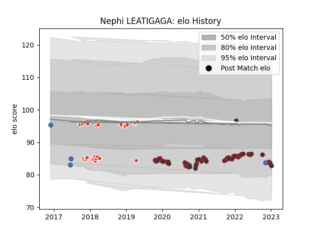

---  
layout: page  
title: Nephi LEATIGAGA  
date: 2023-01-13 11:27:01.866046  
categories: player  
---
# Nephi LEATIGAGA

## Positions: P

## Country: Samoa

## Current elo: 83.0

## Current Percentile: None

# Elo History

# Match History

| Team               |   Appearances |   Win Rate |
|:-------------------|--------------:|-----------:|
| Leicester Tigers   |            69 |   0.615942 |
| Biarritz Olympique |            28 |   0.571429 |
| Samoa              |             4 |   0.25     |

| Opponent           |   Matches |   Win Rate |
|:-------------------|----------:|-----------:|
| Sale Sharks        |         7 |   0.142857 |
| London Irish       |         6 |   0.666667 |
| Exeter Chiefs      |         6 |   0.333333 |
| Worcester Warriors |         5 |   0.8      |
| Gloucester Rugby   |         5 |   0.8      |
| Saracens           |         5 |   0.4      |
| Northampton Saints |         5 |   0.8      |
| Bayonne            |         4 |   1        |
| Wasps              |         4 |   0.75     |
| Bristol Rugby      |         4 |   0.5      |
| Harlequins         |         4 |   0.375    |
| Vannes             |         3 |   0.333333 |
| Newcastle Falcons  |         3 |   0.666667 |
| Bath Rugby         |         3 |   0.666667 |
| Aurillac           |         3 |   0.666667 |
| Colomiers          |         3 |   0.333333 |
| Mont-de-Marsan     |         2 |   0.5      |
| Perpignan          |         2 |   0.5      |
| Connacht           |         2 |   1        |
| Brive              |         2 |   0.5      |
| Narbonne           |         2 |   1        |
| Calvisano          |         2 |   1        |
| Cardiff Blues      |         2 |   1        |
| Beziers            |         1 |   1        |
| Wales              |         1 |   0        |
| Toulon             |         1 |   0        |
| Soyaux-Angouleme   |         1 |   0        |
| Canada             |         1 |   1        |
| Provence Rugby     |         1 |   1        |
| Grenoble           |         1 |   0        |
| Pau                |         1 |   1        |
| Oyonnax            |         1 |   1        |
| Dax                |         1 |   1        |
| Clermont Auvergne  |         1 |   1        |
| New Zealand        |         1 |   0        |
| Nevers             |         1 |   1        |
| Montauban          |         1 |   0        |
| Massy              |         1 |   0        |
| Italy              |         1 |   0        |
| Ospreys            |         1 |   1        |