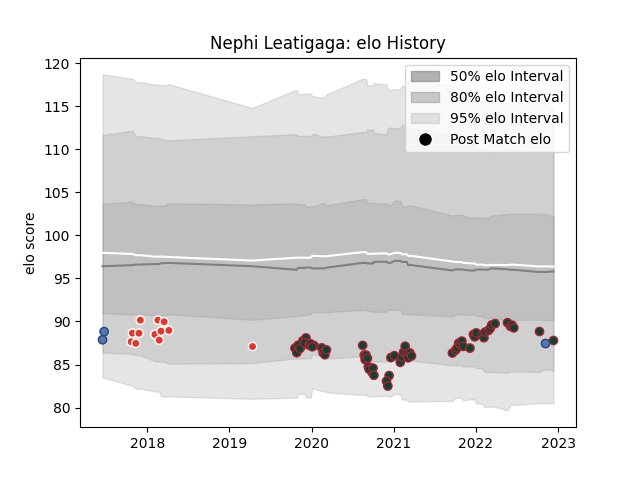

---  
layout: page  
title: Nephi Leatigaga  
date: 2022-12-18 16:27:10.184085  
categories: player  
---
# Nephi Leatigaga

## Positions: P

## Country: Samoa

## Current elo: 88.0

## Current Percentile: 19.0

# Elo History

# Match History

| Team               |   Appearances |   Win Rate |
|:-------------------|--------------:|-----------:|
| Leicester Tigers   |            65 |   0.623077 |
| Biarritz Olympique |            12 |   0.583333 |
| Samoa              |             3 |   0        |

| Opponent           |   Matches |   Win Rate |
|:-------------------|----------:|-----------:|
| London Irish       |         6 |   0.666667 |
| Exeter Chiefs      |         6 |   0.333333 |
| Sale Sharks        |         6 |   0.166667 |
| Saracens           |         5 |   0.4      |
| Northampton Saints |         5 |   0.8      |
| Worcester Warriors |         5 |   0.8      |
| Harlequins         |         4 |   0.375    |
| Wasps              |         4 |   0.75     |
| Bristol Rugby      |         4 |   0.5      |
| Gloucester Rugby   |         4 |   0.75     |
| Bath Rugby         |         3 |   0.666667 |
| Cardiff Blues      |         2 |   1        |
| Bayonne            |         2 |   1        |
| Newcastle Falcons  |         2 |   1        |
| Narbonne           |         2 |   1        |
| Aurillac           |         2 |   0.5      |
| Calvisano          |         2 |   1        |
| Perpignan          |         1 |   1        |
| Colomiers          |         1 |   0        |
| Wales              |         1 |   0        |
| Vannes             |         1 |   1        |
| Toulon             |         1 |   0        |
| Connacht           |         1 |   1        |
| Dax                |         1 |   1        |
| Italy              |         1 |   0        |
| Grenoble           |         1 |   0        |
| Ospreys            |         1 |   1        |
| Brive              |         1 |   1        |
| New Zealand        |         1 |   0        |
| Clermont Auvergne  |         1 |   1        |
| Mont-de-Marsan     |         1 |   0        |
| Massy              |         1 |   0        |
| Pau                |         1 |   1        |