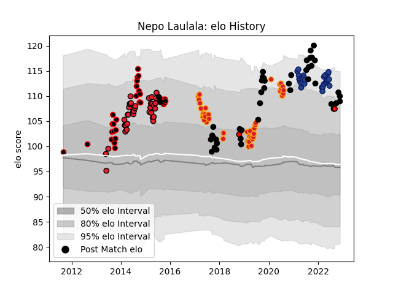

---  
layout: page  
title: Nepo Laulala  
date: 2023-03-02 11:22:50.483587  
categories: player  
---
# Nepo Laulala

## Positions: P

## Country: New Zealand

## Current elo: 120.0

## Current Percentile: 94.0

# Elo History

# Match History

| Team             |   Appearances |   Win Rate |
|:-----------------|--------------:|-----------:|
| New Zealand      |            47 |   0.797872 |
| Canterbury       |            41 |   0.780488 |
| Chiefs           |            41 |   0.52439  |
| Crusaders        |            36 |   0.638889 |
| Blues            |            27 |   0.777778 |
| Counties Manukau |             4 |   0.25     |

| Opponent                 |   Matches |   Win Rate |
|:-------------------------|----------:|-----------:|
| Highlanders              |        16 |   0.65625  |
| Australia                |        13 |   0.846154 |
| Blues                    |        12 |   0.625    |
| Hurricanes               |        12 |   0.458333 |
| Crusaders                |        11 |   0.181818 |
| Chiefs                   |         8 |   0.375    |
| Argentina                |         7 |   0.857143 |
| Brumbies                 |         7 |   0.857143 |
| Queensland Reds          |         6 |   1        |
| Tasman                   |         6 |   0.5      |
| Taranaki                 |         6 |   0.666667 |
| South Africa             |         5 |   0.8      |
| Melbourne Rebels         |         5 |   1        |
| Auckland                 |         5 |   0.8      |
| New South Wales Waratahs |         5 |   0.6      |
| Waikato                  |         5 |   0.8      |
| North Harbour            |         4 |   0.75     |
| Sharks                   |         4 |   0.75     |
| Ireland                  |         4 |   0.25     |
| Wellington               |         4 |   0.75     |
| Southland                |         3 |   0.666667 |
| England                  |         3 |   0.5      |
| Wales                    |         3 |   1        |
| Bulls                    |         3 |   0.666667 |
| Lions                    |         3 |   0.666667 |
| Bay of Plenty            |         3 |   0.666667 |
| Otago                    |         3 |   1        |
| Scotland                 |         2 |   1        |
| Northland                |         2 |   1        |
| Stormers                 |         2 |   1        |
| Western Force            |         2 |   1        |
| Fiji                     |         2 |   1        |
| Counties Manukau         |         2 |   1        |
| Jaguares                 |         2 |   0.5      |
| France                   |         2 |   0.5      |
| Cheetahs                 |         2 |   1        |
| British and Irish Lions  |         1 |   0        |
| Canada                   |         1 |   1        |
| Canterbury               |         1 |   0        |
| Tonga                    |         1 |   1        |
| Namibia                  |         1 |   1        |
| Sunwolves                |         1 |   1        |
| Moana Pasifika           |         1 |   1        |
| Fijian Drua              |         1 |   1        |
| Hawke's Bay              |         1 |   1        |
| Italy                    |         1 |   1        |
| Samoa                    |         1 |   1        |
| Japan                    |         1 |   1        |