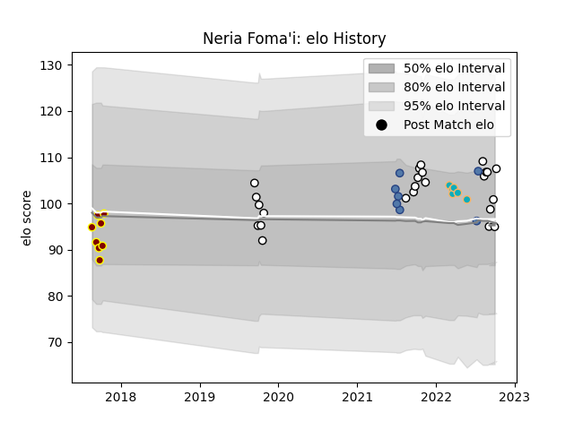

---  
layout: page  
title: Neria Foma'i  
date: 2023-03-04 11:41:49.127204  
categories: player  
---
# Neria Foma'i

## Positions: W, C

## Country: Samoa

## Current elo: 95.0

## Current Percentile: 75.0

# Elo History

# Match History

| Team           |   Appearances |   Win Rate |
|:---------------|--------------:|-----------:|
| Hawke's Bay    |            24 |   0.6875   |
| Southland      |             8 |   0        |
| Samoa          |             7 |   0.714286 |
| Moana Pasifika |             6 |   0.166667 |

| Opponent          |   Matches |   Win Rate |
|:------------------|----------:|-----------:|
| Bay of Plenty     |         5 |   0.2      |
| Tasman            |         5 |   0.4      |
| Tonga             |         4 |   1        |
| Canterbury        |         3 |   0.333333 |
| Wellington        |         3 |   0.333333 |
| Waikato           |         3 |   0.833333 |
| Manawatu          |         3 |   0.666667 |
| Otago             |         3 |   0.666667 |
| New Zealand Maori |         2 |   0        |
| Chiefs            |         2 |   0        |
| Counties Manukau  |         2 |   1        |
| Hurricanes        |         2 |   0.5      |
| Taranaki          |         1 |   1        |
| Auckland          |         1 |   0        |
| Southland         |         1 |   1        |
| North Harbour     |         1 |   1        |
| Hawke's Bay       |         1 |   0        |
| Fiji              |         1 |   1        |
| Crusaders         |         1 |   0        |
| Western Force     |         1 |   0        |