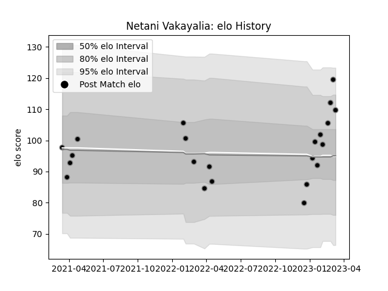

---  
layout: page  
title: Netani Vakayalia  
date: 2023-02-02 18:38:52.658204  
categories: player  
---
# Netani Vakayalia

## Positions: W

## Current elo: 104.0

## Current Percentile: 46.0

# Elo History

# Match History

| Team             |   Appearances |   Win Rate |
|:-----------------|--------------:|-----------:|
| Black Rams Tokyo |            16 |       0.25 |

| Opponent                          |   Matches |   Win Rate |
|:----------------------------------|----------:|-----------:|
| Shizuoka Blue Revs                |         2 |        0.5 |
| Toshiba Brave Lupus Tokyo         |         2 |        0   |
| Toyota Verblitz                   |         2 |        0.5 |
| Yokohama Canon Eagles             |         2 |        0   |
| Green Rockets Tokatsu             |         1 |        1   |
| Hino Red Dolphins                 |         1 |        1   |
| Kobelco Kobe Steelers             |         1 |        0   |
| Kubota Spears Funabashi Tokyo-Bay |         1 |        0   |
| Mitsubishi Dynaboars              |         1 |        0   |
| Saitama Wild Knights              |         1 |        0   |
| Tokyo Sungoliath                  |         1 |        0   |
| Urayasu D-Rocks                   |         1 |        0   |