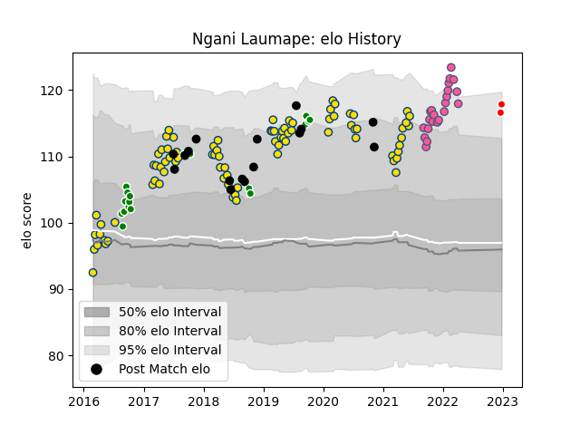

---  
layout: page  
title: Ngani Laumape  
date: 2022-12-28 12:57:35.940284  
categories: player  
---
# Ngani Laumape

## Positions: C

## Country: New Zealand

## Current elo: 118.0

## Current Percentile: 92.0

# Elo History

# Match History

| Team                  |   Appearances |   Win Rate |
|:----------------------|--------------:|-----------:|
| Hurricanes            |            85 |   0.658824 |
| Stade Francais Paris  |            22 |   0.454545 |
| Manawatu              |            18 |   0.444444 |
| New Zealand           |            16 |   0.78125  |
| Kobelco Kobe Steelers |             2 |   0.5      |

| Opponent                 |   Matches |   Win Rate |
|:-------------------------|----------:|-----------:|
| Crusaders                |        12 |   0.25     |
| Chiefs                   |        11 |   0.5      |
| Blues                    |        10 |   0.6      |
| Highlanders              |        10 |   0.8      |
| Brumbies                 |         6 |   0.5      |
| Melbourne Rebels         |         5 |   1        |
| Australia                |         5 |   0.6      |
| Sharks                   |         4 |   0.75     |
| Jaguares                 |         4 |   0.75     |
| Argentina                |         4 |   1        |
| Bulls                    |         3 |   0.666667 |
| France                   |         3 |   1        |
| New South Wales Waratahs |         3 |   1        |
| Lions                    |         3 |   0.666667 |
| Southland                |         3 |   1        |
| Western Force            |         3 |   1        |
| British and Irish Lions  |         3 |   0.333333 |
| Queensland Reds          |         3 |   1        |
| Sunwolves                |         3 |   1        |
| Stade Toulousain         |         2 |   1        |
| Bay of Plenty            |         2 |   0        |
| Stormers                 |         2 |   0.5      |
| Hawke's Bay              |         2 |   0        |
| Taranaki                 |         2 |   0        |
| Canterbury               |         2 |   1        |
| Toulon                   |         2 |   0.5      |
| Bordeaux Begles          |         2 |   0        |
| Otago                    |         2 |   0        |
| Lyon                     |         2 |   0.5      |
| Biarritz Olympique       |         2 |   0.5      |
| Racing 92                |         2 |   0        |
| Castres Olympique        |         2 |   0.5      |
| Perpignan                |         1 |   1        |
| Southern Kings           |         1 |   1        |
| Wellington               |         1 |   1        |
| Waikato                  |         1 |   0        |
| Japan                    |         1 |   1        |
| Pau                      |         1 |   0        |
| Northland                |         1 |   1        |
| North Harbour            |         1 |   0        |
| Montpellier Herault      |         1 |   0        |
| La Rochelle              |         1 |   1        |
| Italy                    |         1 |   1        |
| Hanazono Kintetsu Liners |         1 |   1        |
| Counties Manukau         |         1 |   1        |
| Connacht                 |         1 |   1        |
| Clermont Auvergne        |         1 |   1        |
| Cheetahs                 |         1 |   1        |
| Brive                    |         1 |   0        |
| Bristol Rugby            |         1 |   0        |
| Yokohama Canon Eagles    |         1 |   0        |