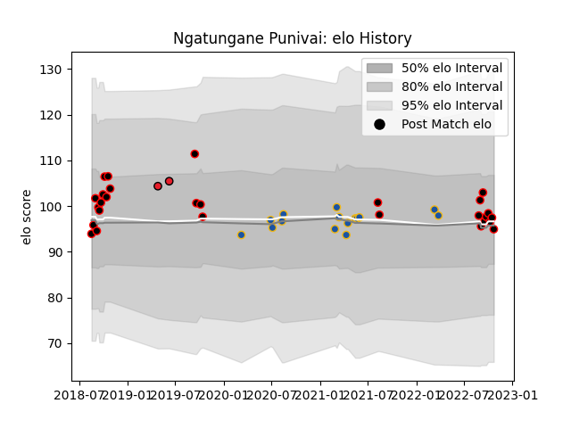

---  
layout: page  
title: Ngatungane Punivai  
date: 2023-03-04 11:34:12.455820  
categories: player  
---
# Ngatungane Punivai

## Positions: W, C

## Current elo: 95.0

## Current Percentile: 52.0

# Elo History

# Match History

| Team        |   Appearances |   Win Rate |
|:------------|--------------:|-----------:|
| Canterbury  |            28 |   0.785714 |
| Highlanders |            15 |   0.4      |
| Crusaders   |             2 |   1        |

| Opponent         |   Matches |   Win Rate |
|:-----------------|----------:|-----------:|
| Blues            |         5 |   0.2      |
| Auckland         |         4 |   0.25     |
| North Harbour    |         3 |   1        |
| Tasman           |         3 |   0.666667 |
| Otago            |         3 |   1        |
| Northland        |         3 |   1        |
| Manawatu         |         3 |   0.666667 |
| Crusaders        |         3 |   0        |
| Hawke's Bay      |         2 |   1        |
| Bay of Plenty    |         2 |   1        |
| Melbourne Rebels |         2 |   1        |
| Counties Manukau |         2 |   1        |
| Chiefs           |         2 |   0.5      |
| Wellington       |         2 |   0.5      |
| Hurricanes       |         1 |   1        |
| Lions            |         1 |   1        |
| Queensland Reds  |         1 |   1        |
| Taranaki         |         1 |   1        |
| Bulls            |         1 |   0        |
| Western Force    |         1 |   1        |