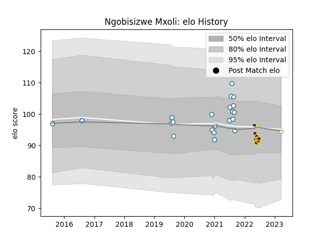

---  
layout: page  
title: Ngobisizwe Mxoli  
date: 2023-03-21 18:32:04.773202  
categories: player  
---
# Ngobisizwe Mxoli

Last updated: 2023-03-21
## Positions: P

## Current elo: 95.0

## Current Percentile: None

# Elo History

# Match History

| Team                |   Appearances |   Win Rate |
|:--------------------|--------------:|-----------:|
| Griquas             |            19 |   0.342105 |
| Griffons            |             8 |   1        |
| Blue Bulls          |             2 |   1        |
| Free State Cheetahs |             1 |   1        |

| Opponent               |   Matches |   Win Rate |
|:-----------------------|----------:|-----------:|
| Western Province       |         5 |   0.8      |
| Free State Cheetahs    |         4 |   0.25     |
| Golden Lions           |         4 |   0.25     |
| Natal Sharks           |         3 |   0.333333 |
| Pumas                  |         3 |   0.166667 |
| Blue Bulls             |         2 |   0.5      |
| Eastern Province Kings |         2 |   1        |
| Black Lion             |         1 |   1        |
| Boland Cavaliers       |         1 |   1        |
| Griffons               |         1 |   1        |
| Leopards               |         1 |   1        |
| SWD Eagles             |         1 |   1        |
| Tusker Simba           |         1 |   1        |
| Valke                  |         1 |   1        |