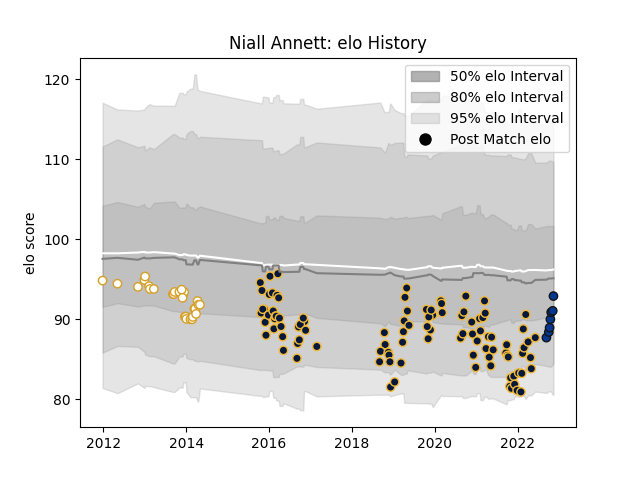

---  
layout: page  
title: Niall Annett  
date: 2022-12-14 11:19:47.867640  
categories: player  
---
# Niall Annett

## Positions: H

## Current elo: 93.0

## Current Percentile: 46.0

# Elo History

# Match History

| Team               |   Appearances |   Win Rate |
|:-------------------|--------------:|-----------:|
| Worcester Warriors |           101 |   0.321782 |
| Ulster             |            28 |   0.571429 |
| Bath Rugby         |             9 |   0.333333 |

| Opponent             |   Matches |   Win Rate |
|:---------------------|----------:|-----------:|
| Northampton Saints   |        12 |   0.166667 |
| Harlequins           |        11 |   0.363636 |
| Sale Sharks          |        10 |   0.45     |
| Gloucester Rugby     |         9 |   0.277778 |
| Bath Rugby           |         8 |   0.125    |
| Exeter Chiefs        |         8 |   0.125    |
| Saracens             |         8 |   0.25     |
| Leicester Tigers     |         8 |   0.25     |
| Bristol Rugby        |         8 |   0.375    |
| London Irish         |         7 |   0.571429 |
| Wasps                |         7 |   0.142857 |
| Newcastle Falcons    |         6 |   0.75     |
| Ospreys              |         4 |   0.75     |
| Edinburgh            |         4 |   0.75     |
| Leinster             |         3 |   0        |
| Benetton Treviso     |         3 |   1        |
| Munster              |         3 |   0.333333 |
| Glasgow Warriors     |         3 |   0        |
| Scarlets             |         3 |   0.666667 |
| Dragons              |         3 |   0.333333 |
| Zebre                |         3 |   1        |
| Connacht             |         2 |   1        |
| Castres Olympique    |         1 |   0        |
| La Rochelle          |         1 |   1        |
| Pau                  |         1 |   0        |
| Cardiff Blues        |         1 |   0        |
| Stade Francais Paris |         1 |   1        |