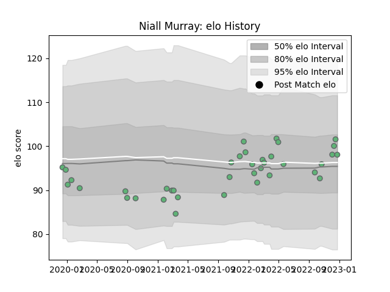

---  
layout: page  
title: Niall Murray  
date: 2023-02-02 18:48:09.154944  
categories: player  
---
# Niall Murray

## Positions: L

## Current elo: 119.0

## Current Percentile: 85.0

# Elo History

# Match History

| Team     |   Appearances |   Win Rate |
|:---------|--------------:|-----------:|
| Connacht |            41 |   0.463415 |

| Opponent             |   Matches |   Win Rate |
|:---------------------|----------:|-----------:|
| Ulster               |         5 |   0.4      |
| Leinster             |         4 |   0        |
| Benetton Treviso     |         3 |   1        |
| Edinburgh            |         3 |   0        |
| Munster              |         3 |   0        |
| Scarlets             |         3 |   0.666667 |
| Ospreys              |         2 |   0.5      |
| Stormers             |         2 |   0.5      |
| Stade Francais Paris |         2 |   0.5      |
| Leicester Tigers     |         2 |   0        |
| Lions                |         2 |   1        |
| Brive                |         2 |   1        |
| Sharks               |         1 |   0        |
| Montpellier Herault  |         1 |   0        |
| Newcastle Falcons    |         1 |   1        |
| Gloucester Rugby     |         1 |   1        |
| Glasgow Warriors     |         1 |   1        |
| Dragons              |         1 |   1        |
| Cardiff Blues        |         1 |   0        |
| Zebre                |         1 |   1        |