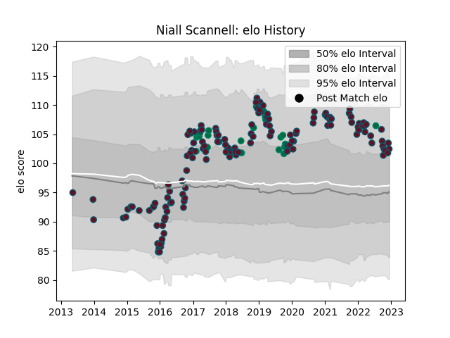

---  
layout: page  
title: Niall Scannell  
date: 2022-12-14 11:24:46.395294  
categories: player  
---
# Niall Scannell

## Positions: H

## Country: Ireland

## Current elo: 103.0

## Current Percentile: 77.0

# Elo History

# Match History

| Team    |   Appearances |   Win Rate |
|:--------|--------------:|-----------:|
| Munster |           140 |   0.653571 |
| Ireland |            22 |   0.818182 |

| Opponent                 |   Matches |   Win Rate |
|:-------------------------|----------:|-----------:|
| Leinster                 |        15 |   0.133333 |
| Connacht                 |        13 |   0.692308 |
| Ulster                   |        11 |   0.545455 |
| Zebre                    |        10 |   1        |
| Glasgow Warriors         |        10 |   0.7      |
| Edinburgh                |         8 |   1        |
| Cardiff Blues            |         8 |   0.625    |
| Scarlets                 |         7 |   0.714286 |
| Ospreys                  |         7 |   0.714286 |
| Dragons                  |         7 |   0.714286 |
| Castres Olympique        |         6 |   0.75     |
| Benetton Treviso         |         6 |   1        |
| Racing 92                |         5 |   0.5      |
| Leicester Tigers         |         5 |   0.4      |
| Italy                    |         4 |   1        |
| Saracens                 |         4 |   0.25     |
| Southern Kings           |         3 |   1        |
| Wales                    |         3 |   0.333333 |
| Stade Toulousain         |         2 |   0.5      |
| United States of America |         2 |   1        |
| Scotland                 |         2 |   0.5      |
| Stade Francais Paris     |         2 |   0.5      |
| Australia                |         2 |   1        |
| Japan                    |         2 |   1        |
| France                   |         2 |   1        |
| Exeter Chiefs            |         2 |   0.75     |
| Cheetahs                 |         2 |   1        |
| Bulls                    |         2 |   0.5      |
| Russia                   |         1 |   1        |
| Samoa                    |         1 |   1        |
| New Zealand Maori        |         1 |   1        |
| Lions                    |         1 |   0        |
| Sharks                   |         1 |   1        |
| Gloucester Rugby         |         1 |   1        |
| Stormers                 |         1 |   1        |
| Toulon                   |         1 |   1        |
| England                  |         1 |   1        |
| New Zealand              |         1 |   0        |