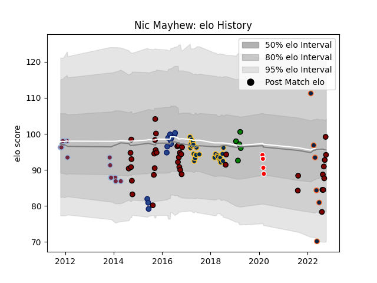

---  
layout: page  
title: Nic Mayhew  
date: 2023-03-17 17:42:46.087704  
categories: player  
---
# Nic Mayhew

## Positions: P

## Current elo: 94.0

## Current Percentile: 61.0

# Elo History

# Match History

| Team               |   Appearances |   Win Rate |
|:-------------------|--------------:|-----------:|
| North Harbour      |            39 |   0.538462 |
| Brumbies           |            24 |   0.458333 |
| Harlequins         |            15 |   0.666667 |
| Blues              |            12 |   0.541667 |
| R.U. New York      |             8 |   0.625    |
| Rugby New York     |             6 |   0.666667 |
| Yorkshire Carnegie |             5 |   0.8      |
| Sunwolves          |             4 |   0        |

| Opponent                 |   Matches |   Win Rate |
|:-------------------------|----------:|-----------:|
| Northland                |         5 |   0.8      |
| Hurricanes               |         5 |   0.2      |
| Manawatu                 |         4 |   0.75     |
| Queensland Reds          |         4 |   0.375    |
| Leicester Tigers         |         4 |   0.75     |
| Seattle Seawolves        |         4 |   1        |
| Counties Manukau         |         4 |   1        |
| Otago                    |         4 |   0.25     |
| New South Wales Waratahs |         3 |   1        |
| Lions                    |         3 |   0        |
| Old Glory DC             |         3 |   1        |
| Jaguares                 |         3 |   0.666667 |
| Highlanders              |         3 |   0        |
| Hawke's Bay              |         3 |   0.333333 |
| Auckland                 |         3 |   0        |
| Melbourne Rebels         |         3 |   0.666667 |
| Crusaders                |         3 |   0        |
| Southland                |         3 |   1        |
| Waikato                  |         3 |   0.333333 |
| Wellington               |         3 |   0.333333 |
| Bay of Plenty            |         3 |   0.333333 |
| Rugby ATL                |         3 |   0.333333 |
| Sale Sharks              |         2 |   0.5      |
| Sharks                   |         2 |   0.5      |
| Southern Kings           |         2 |   1        |
| Tasman                   |         2 |   0.5      |
| New England Free Jacks   |         2 |   0        |
| Western Force            |         2 |   1        |
| Chiefs                   |         2 |   0        |
| Brumbies                 |         2 |   0.5      |
| Gloucester Rugby         |         2 |   1        |
| Canterbury               |         2 |   0.5      |
| Cardiff Blues            |         2 |   0        |
| London Scottish          |         1 |   1        |
| Blues                    |         1 |   0        |
| Bulls                    |         1 |   1        |
| Sunwolves                |         1 |   1        |
| Stade Toulousain         |         1 |   1        |
| Connacht                 |         1 |   1        |
| Bath Rugby               |         1 |   1        |
| Coventry                 |         1 |   1        |
| Exeter Chiefs            |         1 |   0        |
| Richmond                 |         1 |   1        |
| Houston SaberCats        |         1 |   1        |
| Jersey                   |         1 |   0        |
| L. A. Giltinis           |         1 |   0        |
| Newcastle Falcons        |         1 |   1        |
| London Irish             |         1 |   1        |