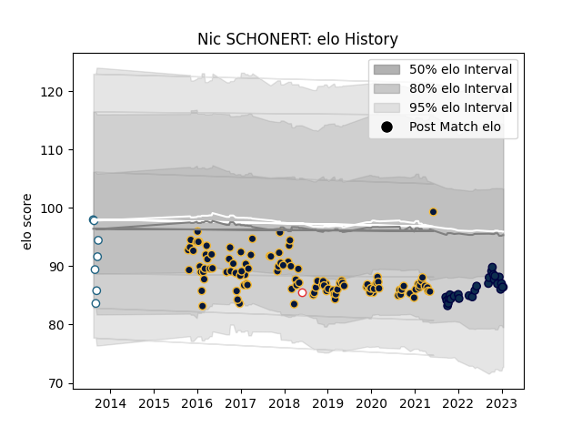

---  
layout: page  
title: Nic SCHONERT  
date: 2023-02-02 19:01:11.459445  
categories: player  
---
# Nic SCHONERT

## Positions: P

## Country: England

## Current elo: 86.0

## Current Percentile: 21.0

# Elo History

# Match History

| Team               |   Appearances |   Win Rate |
|:-------------------|--------------:|-----------:|
| Worcester Warriors |           109 |   0.334862 |
| Sale Sharks        |            29 |   0.568966 |
| Griquas            |             7 |   0.142857 |
| England            |             1 |   0        |

| Opponent            |   Matches |   Win Rate |
|:--------------------|----------:|-----------:|
| Harlequins          |        14 |   0.5      |
| Northampton Saints  |        12 |   0.25     |
| Sale Sharks         |        12 |   0.291667 |
| Gloucester Rugby    |        11 |   0.363636 |
| Wasps               |        11 |   0.181818 |
| Leicester Tigers    |        11 |   0.454545 |
| Bristol Rugby       |        10 |   0.5      |
| Newcastle Falcons   |         9 |   0.555556 |
| London Irish        |         9 |   0.722222 |
| Saracens            |         9 |   0.333333 |
| Exeter Chiefs       |         8 |   0.125    |
| Bath Rugby          |         8 |   0.5      |
| Dragons             |         3 |   0        |
| Stade Toulousain    |         2 |   0        |
| Castres Olympique   |         2 |   0        |
| Natal Sharks        |         2 |   0.5      |
| Western Province    |         2 |   0        |
| Ulster              |         1 |   1        |
| Worcester Warriors  |         1 |   0        |
| Barbarians          |         1 |   0        |
| RC Enisei           |         1 |   1        |
| Pau                 |         1 |   1        |
| La Rochelle         |         1 |   0        |
| Golden Lions        |         1 |   0        |
| Free State Cheetahs |         1 |   0        |
| Cardiff Blues       |         1 |   1        |
| Blue Bulls          |         1 |   0        |
| Zebre               |         1 |   0        |