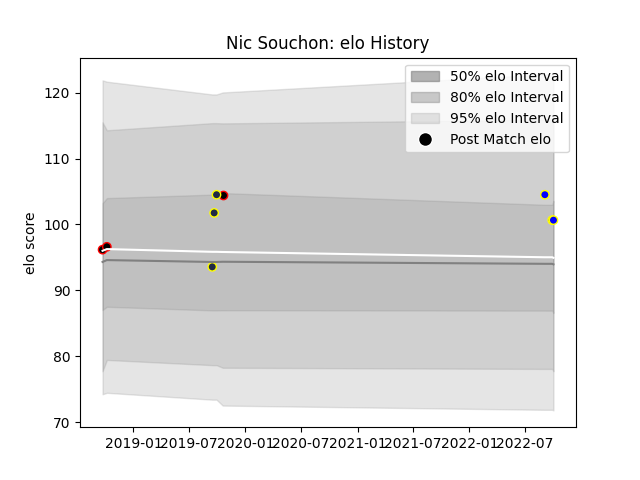

---  
layout: page  
title: Nic Souchon  
date: 2023-03-09 10:08:25.359619  
categories: player  
---
# Nic Souchon

## Positions: H

## Current elo: 101.0

## Current Percentile: None

# Elo History

# Match History

| Team          |   Appearances |   Win Rate |
|:--------------|--------------:|-----------:|
| Bay of Plenty |             3 |   0.333333 |
| Canterbury    |             3 |   0.666667 |
| Otago         |             3 |   0.666667 |

| Opponent      |   Matches |   Win Rate |
|:--------------|----------:|-----------:|
| Otago         |         2 |        1   |
| Waikato       |         2 |        0.5 |
| Wellington    |         2 |        0   |
| North Harbour |         1 |        1   |
| Northland     |         1 |        0   |
| Taranaki      |         1 |        1   |