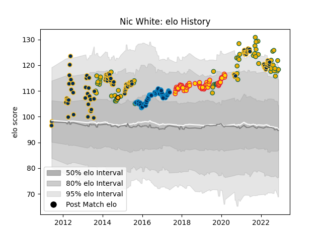

---  
layout: page  
title: Nic White  
date: 2022-11-22 11:27:36.286204  
categories: player  
---
# Nic White

## Positions: SH

## Country: Australia

## Current elo: 135.0

## Current Percentile: 99.0

# Elo History

# Match History

| Team                |   Appearances |   Win Rate |
|:--------------------|--------------:|-----------:|
| Brumbies            |            99 |   0.656566 |
| Exeter Chiefs       |            61 |   0.729508 |
| Australia           |            58 |   0.474138 |
| Montpellier Herault |            57 |   0.701754 |

| Opponent                 |   Matches |   Win Rate |
|:-------------------------|----------:|-----------:|
| New Zealand              |        17 |   0.235294 |
| Queensland Reds          |        16 |   0.46875  |
| Argentina                |        14 |   0.75     |
| Western Force            |        12 |   1        |
| New South Wales Waratahs |        12 |   0.666667 |
| Melbourne Rebels         |        11 |   0.909091 |
| South Africa             |         9 |   0.444444 |
| Harlequins               |         7 |   0.714286 |
| Blues                    |         7 |   0.285714 |
| Castres Olympique        |         7 |   0.714286 |
| Chiefs                   |         6 |   0.5      |
| Saracens                 |         6 |   0.666667 |
| Hurricanes               |         6 |   0.833333 |
| Gloucester Rugby         |         6 |   0.5      |
| Northampton Saints       |         6 |   0.666667 |
| Sale Sharks              |         5 |   1        |
| England                  |         5 |   0.2      |
| Bulls                    |         5 |   0.6      |
| Racing 92                |         4 |   0.5      |
| Grenoble                 |         4 |   1        |
| Leinster                 |         4 |   0.25     |
| Highlanders              |         4 |   0.75     |
| Newcastle Falcons        |         4 |   0.75     |
| La Rochelle              |         4 |   0.75     |
| Worcester Warriors       |         4 |   0.75     |
| Glasgow Warriors         |         4 |   0.625    |
| France                   |         4 |   0.75     |
| Stade Francais Paris     |         4 |   0.75     |
| Crusaders                |         4 |   0        |
| Clermont Auvergne        |         4 |   0.75     |
| Cheetahs                 |         4 |   0.75     |
| Bordeaux Begles          |         4 |   1        |
| Bath Rugby               |         4 |   1        |
| Stade Toulousain         |         3 |   0.333333 |
| Stormers                 |         3 |   0.666667 |
| Toulon                   |         3 |   0.666667 |
| Pau                      |         3 |   0.333333 |
| Wasps                    |         3 |   0.666667 |
| Sharks                   |         3 |   0.666667 |
| Leicester Tigers         |         3 |   1        |
| Bristol Rugby            |         3 |   0.666667 |
| London Irish             |         3 |   1        |
| Fijian Drua              |         2 |   1        |
| Scotland                 |         2 |   0.5      |
| Bayonne                  |         2 |   1        |
| Wales                    |         2 |   0        |
| Brive                    |         2 |   0        |
| Calvisano                |         2 |   1        |
| Montpellier Herault      |         2 |   1        |
| Agen                     |         2 |   1        |
| Lions                    |         2 |   1        |
| Lyon                     |         2 |   0.5      |
| Georgia                  |         1 |   1        |
| Ireland                  |         1 |   0        |
| Fiji                     |         1 |   1        |
| Southern Kings           |         1 |   0.5      |
| Dragons                  |         1 |   1        |
| Cardiff Blues            |         1 |   1        |
| Japan                    |         1 |   1        |
| Uruguay                  |         1 |   1        |
| Oyonnax                  |         1 |   1        |
| Moana Pasifika           |         1 |   0        |
| Munster                  |         1 |   0        |