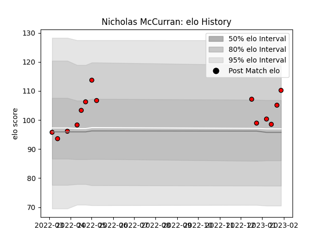

---  
layout: page  
title: Nicholas McCurran  
date: 2023-01-13 11:29:10.218871  
categories: player  
---
# Nicholas McCurran

## Positions: C

## Current elo: 100.0

## Current Percentile: 56.0

# Elo History

# Match History

| Team                      |   Appearances |   Win Rate |
|:--------------------------|--------------:|-----------:|
| Toshiba Brave Lupus Tokyo |            11 |   0.909091 |

| Opponent                        |   Matches |   Win Rate |
|:--------------------------------|----------:|-----------:|
| Black Rams Tokyo                |         2 |          1 |
| Shizuoka Blue Revs              |         2 |          1 |
| Green Rockets Tokatsu           |         1 |          1 |
| Kobelco Kobe Steelers           |         1 |          1 |
| NTT Docomo Red Hurricanes Osaka |         1 |          1 |
| Saitama Wild Knights            |         1 |          0 |
| Tokyo Sungoliath                |         1 |          1 |
| Toyota Verblitz                 |         1 |          1 |
| Yokohama Canon Eagles           |         1 |          1 |