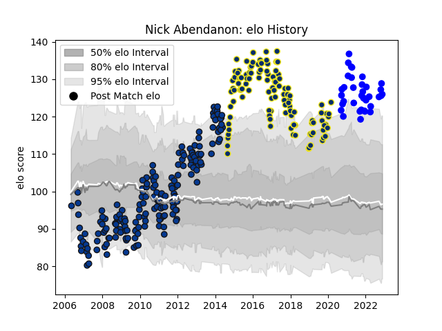

---  
layout: page  
title: Nick Abendanon  
date: 2022-11-22 11:38:56.861323  
categories: player  
---
# Nick Abendanon

## Positions: FB, W

## Current elo: 126.0

## Current Percentile: 98.0

# Elo History

# Match History

| Team              |   Appearances |   Win Rate |
|:------------------|--------------:|-----------:|
| Bath Rugby        |           184 |   0.543478 |
| Clermont Auvergne |           117 |   0.679487 |
| Vannes            |            36 |   0.611111 |

| Opponent                   |   Matches |   Win Rate |
|:---------------------------|----------:|-----------:|
| Saracens                   |        18 |   0.388889 |
| Sale Sharks                |        18 |   0.555556 |
| Northampton Saints         |        17 |   0.382353 |
| Wasps                      |        16 |   0.5625   |
| Leicester Tigers           |        16 |   0.25     |
| Harlequins                 |        16 |   0.46875  |
| London Irish               |        14 |   0.678571 |
| Worcester Warriors         |        11 |   0.772727 |
| Gloucester Rugby           |        11 |   0.5      |
| Stade Toulousain           |        10 |   0.5      |
| Exeter Chiefs              |        10 |   0.9      |
| Agen                       |         8 |   0.875    |
| Racing 92                  |         8 |   0.4375   |
| Pau                        |         8 |   0.625    |
| Grenoble                   |         8 |   1        |
| Newcastle Falcons          |         8 |   0.875    |
| Montpellier Herault        |         8 |   0.375    |
| Stade Francais Paris       |         8 |   0.375    |
| Bordeaux Begles            |         8 |   0.75     |
| Toulon                     |         8 |   0.5      |
| Castres Olympique          |         7 |   0.428571 |
| Ulster                     |         7 |   0.285714 |
| Oyonnax                    |         6 |   0.416667 |
| Lyon                       |         6 |   0.833333 |
| Brive                      |         5 |   0.8      |
| Leeds                      |         5 |   1        |
| Beziers                    |         5 |   0.8      |
| Dragons                    |         5 |   1        |
| Provence Rugby             |         4 |   0.5      |
| Yorkshire Carnegie         |         4 |   1        |
| Bristol Rugby              |         4 |   0.75     |
| Bayonne                    |         4 |   0.5      |
| La Rochelle                |         4 |   1        |
| Biarritz Olympique         |         3 |   0.333333 |
| Carcassonne                |         3 |   0.833333 |
| Glasgow Warriors           |         3 |   0.666667 |
| Leinster                   |         3 |   0.333333 |
| Nevers                     |         3 |   1        |
| London Welsh               |         2 |   0.5      |
| Ospreys                    |         2 |   1        |
| Aironi                     |         2 |   1        |
| Perpignan                  |         2 |   0.5      |
| Valence Romans Drome Rugby |         2 |   0.5      |
| Rouen                      |         2 |   0        |
| Munster                    |         2 |   1        |
| Aurillac                   |         2 |   0.5      |
| Edinburgh                  |         2 |   0.5      |
| Bath Rugby                 |         1 |   1        |
| US Bressane                |         1 |   1        |
| Mont-de-Marsan             |         1 |   1        |
| Bucuresti                  |         1 |   1        |
| Colomiers                  |         1 |   1        |
| Montauban                  |         1 |   0        |
| Narbonne                   |         1 |   0.5      |
| Mogliano                   |         1 |   1        |
| Massy                      |         1 |   1        |