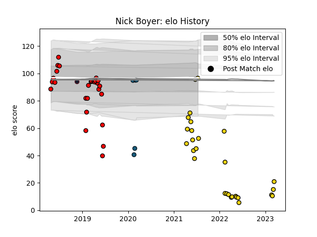

---  
layout: page  
title: Nick Boyer  
date: 2023-03-02 11:25:16.638165  
categories: player  
---
# Nick Boyer

## Positions: SH, W

## Country: United States of America

## Current elo: 97.0

## Current Percentile: 0.0

# Elo History

# Match History

| Team                     |   Appearances |   Win Rate |
|:-------------------------|--------------:|-----------:|
| San Diego Legion         |            27 |   0.648148 |
| Houston SaberCats        |            26 |   0.307692 |
| Colorado Raptors         |             5 |   0.4      |
| United States of America |             1 |   1        |

| Opponent           |   Matches |   Win Rate |
|:-------------------|----------:|-----------:|
| Seattle Seawolves  |         8 |   0.375    |
| NOLA Gold          |         6 |   0.666667 |
| Utah Warriors      |         6 |   0.666667 |
| R.U. New York      |         5 |   0.4      |
| San Diego Legion   |         5 |   0.4      |
| Glendale Raptors   |         4 |   0.625    |
| Houston SaberCats  |         4 |   0.75     |
| Toronto Arrows     |         4 |   0.25     |
| Austin Elite Rugby |         3 |   0.666667 |
| Austin Gilgronis   |         3 |   0        |
| L. A. Giltinis     |         3 |   0.333333 |
| Rugby New York     |         3 |   0.333333 |
| Dallas Jackals     |         2 |   1        |
| Old Glory DC       |         1 |   0        |
| Romania            |         1 |   1        |
| Rugby ATL          |         1 |   0        |