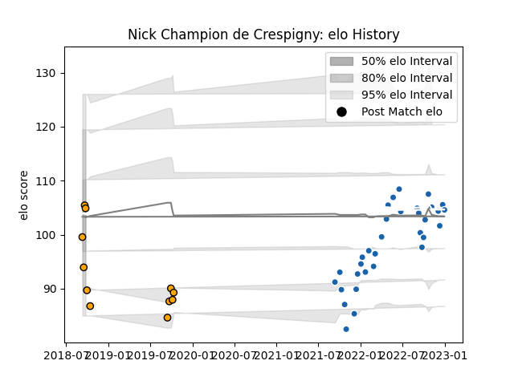

---  
layout: page  
title: Nick Champion de Crespigny  
date: 2022-12-09 13:23:19.112775  
categories: player  
---
# Nick Champion de Crespigny

## Positions: FL, N8

## Current elo: 98.0

## Current Percentile: 66.0

# Elo History

# Match History

| Team               |   Appearances |   Win Rate |
|:-------------------|--------------:|-----------:|
| Castres Olympique  |            29 |   0.586207 |
| NSW Country Eagles |             9 |   0.166667 |

| Opponent             |   Matches |   Win Rate |
|:---------------------|----------:|-----------:|
| Toulon               |         3 |   0.666667 |
| Stade Toulousain     |         3 |   0.666667 |
| Racing 92            |         3 |   0.333333 |
| Montpellier Herault  |         3 |   0.666667 |
| Western Force        |         2 |   0.5      |
| Perpignan            |         2 |   0.5      |
| Brive                |         2 |   1        |
| Clermont Auvergne    |         2 |   1        |
| Fijian Drua          |         2 |   0.25     |
| Harlequins           |         2 |   0        |
| La Rochelle          |         2 |   0.5      |
| Stade Francais Paris |         2 |   1        |
| Queensland Country   |         2 |   0        |
| Biarritz Olympique   |         1 |   1        |
| Pau                  |         1 |   1        |
| Munster              |         1 |   0        |
| Bordeaux Begles      |         1 |   0        |
| Lyon                 |         1 |   0        |
| Canberra Vikings     |         1 |   0        |
| Brisbane City        |         1 |   0        |
| Melbourne Rising     |         1 |   0        |