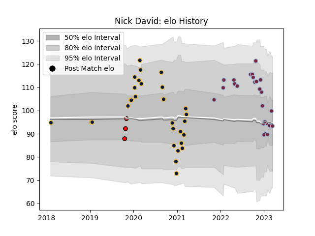

---  
layout: page  
title: Nick David  
date: 2022-12-09 13:21:45.521005  
categories: player  
---
# Nick David

## Positions: W, FB

## Current elo: 99.0

## Current Percentile: 53.0

# Elo History

# Match History

| Team               |   Appearances |   Win Rate |
|:-------------------|--------------:|-----------:|
| Worcester Warriors |            28 |   0.214286 |
| Harlequins         |            14 |   0.714286 |
| Hartpury College   |             3 |   0.333333 |

| Opponent             |   Matches |   Win Rate |
|:---------------------|----------:|-----------:|
| Bath Rugby           |         6 |   0.166667 |
| Northampton Saints   |         4 |   0.25     |
| Leicester Tigers     |         4 |   0.25     |
| London Irish         |         3 |   0.666667 |
| Gloucester Rugby     |         3 |   0.666667 |
| Wasps                |         3 |   0.333333 |
| Exeter Chiefs        |         3 |   0        |
| Dragons              |         3 |   0.333333 |
| Bristol Rugby        |         3 |   0        |
| Castres Olympique    |         2 |   0.5      |
| Newcastle Falcons    |         2 |   0.5      |
| Ospreys              |         2 |   0.5      |
| RC Enisei            |         2 |   1        |
| Sale Sharks          |         2 |   0.5      |
| Nottingham           |         1 |   1        |
| Stade Francais Paris |         1 |   1        |
| Ampthill             |         1 |   0        |