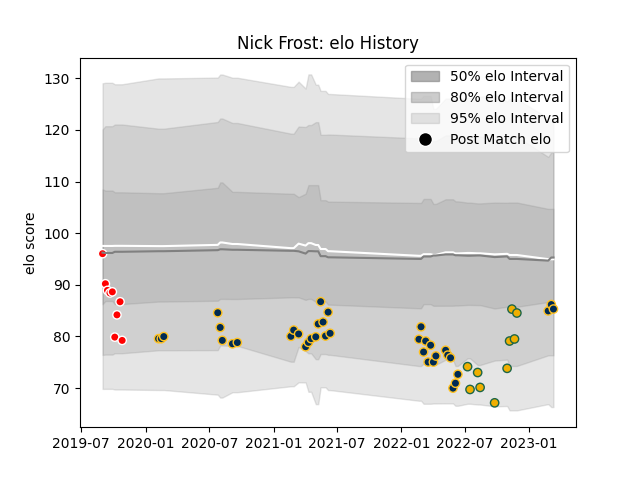

---  
layout: page  
title: Nick Frost  
date: 2023-02-24 09:52:51.691967  
categories: player  
---
# Nick Frost

## Positions: L

## Country: Australia

## Current elo: 79.0

## Current Percentile: 24.0

# Elo History

# Match History

| Team             |   Appearances |   Win Rate |
|:-----------------|--------------:|-----------:|
| Brumbies         |            35 |   0.571429 |
| Australia        |             9 |   0.222222 |
| Canberra Vikings |             9 |   0.666667 |

| Opponent                 |   Matches |   Win Rate |
|:-------------------------|----------:|-----------:|
| Queensland Reds          |         8 |   0.375    |
| Western Force            |         7 |   0.714286 |
| Melbourne Rebels         |         4 |   0.75     |
| Fijian Drua              |         4 |   1        |
| Chiefs                   |         3 |   0.666667 |
| New South Wales Waratahs |         3 |   1        |
| Blues                    |         3 |   0        |
| Hurricanes               |         2 |   1        |
| Argentina                |         2 |   0.5      |
| Highlanders              |         2 |   0        |
| England                  |         2 |   0        |
| Crusaders                |         2 |   0        |
| Ireland                  |         1 |   0        |
| France                   |         1 |   0        |
| Melbourne Rising         |         1 |   1        |
| Moana Pasifika           |         1 |   0        |
| NSW Country Eagles       |         1 |   1        |
| New Zealand              |         1 |   0        |
| Queensland Country       |         1 |   0        |
| Brisbane City            |         1 |   1        |
| Scotland                 |         1 |   1        |
| Sydney Rays              |         1 |   1        |
| Italy                    |         1 |   0        |