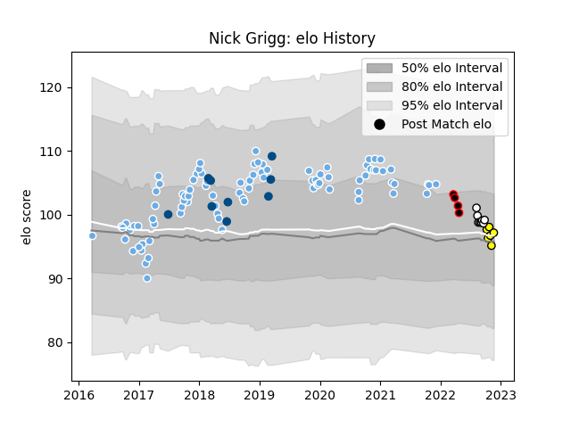

---  
layout: page  
title: Nick Grigg  
date: 2022-11-22 11:43:03.495680  
categories: player  
---
# Nick Grigg

## Positions: C

## Country: Scotland

## Current elo: 97.0

## Current Percentile: 47.0

# Elo History

# Match History

| Team                            |   Appearances |   Win Rate |
|:--------------------------------|--------------:|-----------:|
| Glasgow Warriors                |            88 |   0.539773 |
| Scotland                        |             9 |   0.388889 |
| Hawke's Bay                     |             8 |   0.4375   |
| Carcassonne                     |             6 |   0.333333 |
| NTT Docomo Red Hurricanes Osaka |             4 |   0.25     |

| Opponent                          |   Matches |   Win Rate |
|:----------------------------------|----------:|-----------:|
| Edinburgh                         |        12 |   0.416667 |
| Ospreys                           |         8 |   0.625    |
| Dragons                           |         8 |   0.5625   |
| Leinster                          |         8 |   0.25     |
| Munster                           |         7 |   0.285714 |
| Zebre                             |         7 |   1        |
| Cardiff Blues                     |         6 |   0.833333 |
| Scarlets                          |         6 |   0.333333 |
| Benetton Treviso                  |         4 |   1        |
| Ulster                            |         3 |   0        |
| Connacht                          |         3 |   0.666667 |
| Cheetahs                          |         2 |   1        |
| England                           |         2 |   0.75     |
| Exeter Chiefs                     |         2 |   0        |
| Saracens                          |         2 |   0        |
| Southern Kings                    |         2 |   0.5      |
| La Rochelle                       |         2 |   0.5      |
| Leicester Tigers                  |         2 |   1        |
| Oyonnax                           |         1 |   0        |
| Wellington                        |         1 |   0        |
| Rouen                             |         1 |   1        |
| Sale Sharks                       |         1 |   1        |
| Southland                         |         1 |   1        |
| Soyaux-Angouleme                  |         1 |   0        |
| Toshiba Brave Lupus Tokyo         |         1 |   0        |
| Otago                             |         1 |   0        |
| United States of America          |         1 |   0        |
| Wales                             |         1 |   0        |
| Waikato                           |         1 |   0.5      |
| Toyota Verblitz                   |         1 |   0        |
| Argentina                         |         1 |   1        |
| North Harbour                     |         1 |   1        |
| Montpellier Herault               |         1 |   0        |
| Massy                             |         1 |   0        |
| Lyon                              |         1 |   1        |
| Aurillac                          |         1 |   1        |
| Kubota Spears Funabashi Tokyo-Bay |         1 |   0        |
| Italy                             |         1 |   1        |
| Ireland                           |         1 |   0        |
| Grenoble                          |         1 |   0        |
| Green Rockets Tokatsu             |         1 |   1        |
| France                            |         1 |   0        |
| Fiji                              |         1 |   0        |
| Counties Manukau                  |         1 |   1        |
| Canterbury                        |         1 |   0        |
| Bay of Plenty                     |         1 |   0        |
| Lions                             |         1 |   1        |