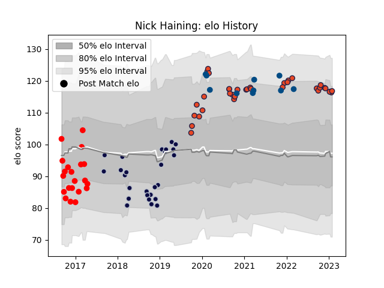

---  
layout: page  
title: Nick Haining  
date: 2022-12-09 13:23:17.572873  
categories: player  
---
# Nick Haining

## Positions: N8, FL

## Country: Scotland

## Current elo: 119.0

## Current Percentile: 95.0

# Elo History

# Match History

| Team          |   Appearances |   Win Rate |
|:--------------|--------------:|-----------:|
| Edinburgh     |            31 |   0.612903 |
| Bristol Rugby |            22 |   0.522727 |
| Jersey        |            20 |   0.5      |
| Scotland      |             9 |   0.444444 |

| Opponent            |   Matches |   Win Rate |
|:--------------------|----------:|-----------:|
| Zebre               |         5 |   0.8      |
| Munster             |         4 |   0        |
| Scarlets            |         4 |   0.75     |
| Saracens            |         3 |   0.666667 |
| London Irish        |         3 |   0.333333 |
| Glasgow Warriors    |         3 |   0.333333 |
| France              |         3 |   0.666667 |
| Ealing Trailfinders |         3 |   0.333333 |
| Cornish Pirates     |         3 |   1        |
| Cardiff Blues       |         3 |   1        |
| Wasps               |         3 |   0.333333 |
| Yorkshire Carnegie  |         3 |   0.666667 |
| Rotherham Titans    |         2 |   0.5      |
| Ireland             |         2 |   0        |
| RC Enisei           |         2 |   1        |
| Nottingham          |         2 |   0.5      |
| London Scottish     |         2 |   0.5      |
| Bedford             |         2 |   0.5      |
| Agen                |         2 |   1        |
| La Rochelle         |         2 |   0.5      |
| Benetton Treviso    |         2 |   0.5      |
| Doncaster           |         2 |   0.5      |
| Dragons             |         2 |   1        |
| Jersey              |         1 |   0        |
| Bordeaux Begles     |         1 |   0        |
| Stormers            |         1 |   0        |
| Southern Kings      |         1 |   1        |
| South Africa        |         1 |   0        |
| Connacht            |         1 |   1        |
| Sale Sharks         |         1 |   0.5      |
| Richmond            |         1 |   1        |
| Italy               |         1 |   1        |
| Ospreys             |         1 |   0        |
| Exeter Chiefs       |         1 |   0        |
| Northampton Saints  |         1 |   0        |
| Newcastle Falcons   |         1 |   1        |
| Georgia             |         1 |   1        |
| London Welsh        |         1 |   0        |
| Gloucester Rugby    |         1 |   0        |
| Harlequins          |         1 |   0        |
| Leicester Tigers    |         1 |   1        |
| Hartpury College    |         1 |   1        |
| England             |         1 |   0        |