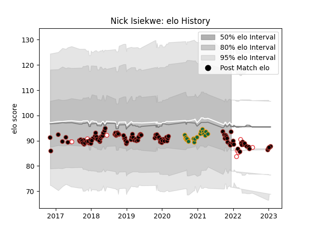

---  
layout: page  
title: Nick Isiekwe  
date: 2023-02-02 19:09:45.860764  
categories: player  
---
# Nick Isiekwe

## Positions: L, FL

## Country: England

## Current elo: 94.0

## Current Percentile: 29.0

# Elo History

# Match History

| Team               |   Appearances |   Win Rate |
|:-------------------|--------------:|-----------:|
| Saracens           |           108 |   0.708333 |
| Northampton Saints |            19 |   0.368421 |
| England            |             9 |   0.666667 |

| Opponent           |   Matches |   Win Rate |
|:-------------------|----------:|-----------:|
| Exeter Chiefs      |        12 |   0.5      |
| Northampton Saints |        11 |   0.909091 |
| Gloucester Rugby   |        10 |   0.6      |
| Harlequins         |        10 |   0.5      |
| Worcester Warriors |         9 |   0.888889 |
| Leicester Tigers   |         9 |   0.444444 |
| Wasps              |         9 |   0.777778 |
| Bristol Rugby      |         8 |   0.5      |
| Sale Sharks        |         8 |   0.625    |
| London Irish       |         8 |   0.6875   |
| Bath Rugby         |         7 |   0.571429 |
| Newcastle Falcons  |         7 |   1        |
| Ospreys            |         3 |   1        |
| Munster            |         2 |   0.5      |
| Argentina          |         2 |   1        |
| Glasgow Warriors   |         2 |   1        |
| Edinburgh          |         2 |   0        |
| Clermont Auvergne  |         2 |   0        |
| Cardiff Blues      |         2 |   1        |
| Leinster           |         2 |   0.5      |
| Australia          |         1 |   1        |
| Italy              |         1 |   1        |
| Lyon               |         1 |   1        |
| France             |         1 |   0        |
| Racing 92          |         1 |   0        |
| Samoa              |         1 |   1        |
| Scarlets           |         1 |   1        |
| Scotland           |         1 |   0        |
| South Africa       |         1 |   0        |
| Wales              |         1 |   1        |
| Brive              |         1 |   1        |