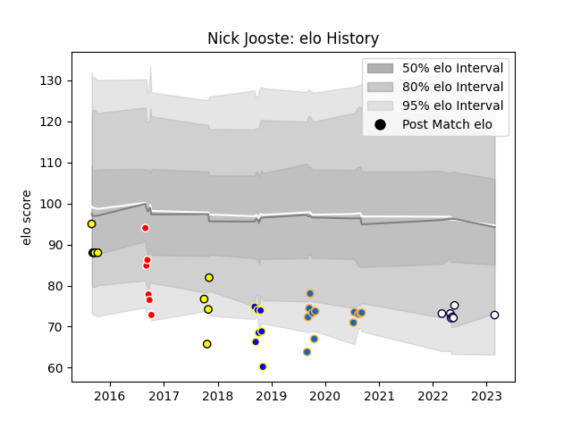

---  
layout: page  
title: Nick Jooste  
date: 2023-03-02 11:24:53.103472  
categories: player  
---
# Nick Jooste

## Positions: C, FB

## Current elo: 73.0

## Current Percentile: 11.0

# Elo History

# Match History

| Team              |   Appearances |   Win Rate |
|:------------------|--------------:|-----------:|
| Western Force     |            12 |   0.583333 |
| Perth Spirit      |             9 |   0.444444 |
| Canberra Vikings  |             7 |   0.428571 |
| Kamaishi Seawaves |             7 |   0.285714 |
| Melbourne Rebels  |             7 |   0.285714 |

| Opponent                        |   Matches |   Win Rate |
|:--------------------------------|----------:|-----------:|
| Canberra Vikings                |         4 |        0.5 |
| Queensland Country              |         4 |        1   |
| Brisbane City                   |         4 |        1   |
| Fijian Drua                     |         2 |        0.5 |
| Greater Sydney Rams             |         2 |        1   |
| North Harbour Rays              |         2 |        0   |
| New South Wales Waratahs        |         2 |        0   |
| Melbourne Rising                |         2 |        0.5 |
| Blues                           |         1 |        0   |
| Moana Pasifika                  |         1 |        1   |
| Sydney Stars                    |         1 |        0   |
| Sydney Rays                     |         1 |        0   |
| Queensland Reds                 |         1 |        0   |
| Perth Spirit                    |         1 |        0   |
| NTT Docomo Red Hurricanes Osaka |         1 |        0   |
| NSW Country Eagles              |         1 |        0   |
| Melbourne Rebels                |         1 |        0   |
| Mitsubishi Dynaboars            |         1 |        0   |
| Mazda Blue Zoomers              |         1 |        0   |
| Kyuden Voltex                   |         1 |        1   |
| Kurita Water Gush               |         1 |        0   |
| Hurricanes                      |         1 |        0   |
| Highlanders                     |         1 |        1   |
| Hanazono Kintetsu Liners        |         1 |        0   |
| Chugoku Red Regulions           |         1 |        1   |
| Chiefs                          |         1 |        0   |
| Brumbies                        |         1 |        0   |
| Western Force                   |         1 |        0   |