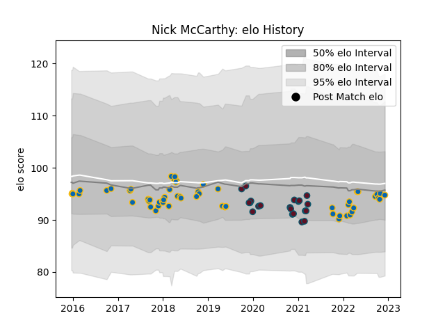

---  
layout: page  
title: Nick McCarthy  
date: 2023-02-02 18:40:10.962301  
categories: player  
---
# Nick McCarthy

## Positions: SH

## Current elo: 101.0

## Current Percentile: 52.0

# Elo History

# Match History

| Team     |   Appearances |   Win Rate |
|:---------|--------------:|-----------:|
| Leinster |            60 |   0.775    |
| Munster  |            21 |   0.809524 |

| Opponent         |   Matches |   Win Rate |
|:-----------------|----------:|-----------:|
| Connacht         |        10 |   0.9      |
| Cardiff Blues    |         8 |   0.875    |
| Ulster           |         7 |   0.428571 |
| Scarlets         |         7 |   0.928571 |
| Zebre            |         6 |   1        |
| Munster          |         6 |   1        |
| Dragons          |         5 |   1        |
| Glasgow Warriors |         5 |   0.8      |
| Benetton Treviso |         4 |   0.75     |
| Edinburgh        |         4 |   0.5      |
| Ospreys          |         4 |   1        |
| Saracens         |         3 |   0.666667 |
| Southern Kings   |         3 |   1        |
| Lions            |         1 |   1        |
| Leinster         |         1 |   0        |
| Gloucester Rugby |         1 |   1        |
| Sharks           |         1 |   0        |
| Stade Toulousain |         1 |   0        |
| Stormers         |         1 |   0        |
| Toulon           |         1 |   0        |
| Cheetahs         |         1 |   0        |
| Wasps            |         1 |   1        |