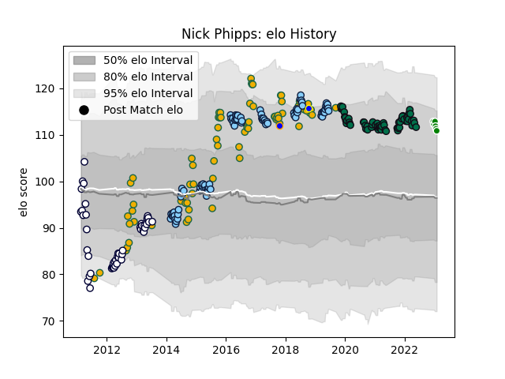

---  
layout: page  
title: Nick Phipps  
date: 2023-01-13 11:27:07.416060  
categories: player  
---
# Nick Phipps

## Positions: SH

## Country: Australia

## Current elo: 113.0

## Current Percentile: 86.0

# Elo History

# Match History

| Team                     |   Appearances |   Win Rate |
|:-------------------------|--------------:|-----------:|
| New South Wales Waratahs |            86 |   0.546512 |
| Australia                |            76 |   0.5      |
| London Irish             |            61 |   0.434426 |
| Melbourne Rebels         |            47 |   0.255319 |
| Green Rockets Tokatsu    |             3 |   0.333333 |
| Greater Sydney Rams      |             1 |   0        |
| Sydney Rays              |             1 |   0        |

| Opponent                 |   Matches |   Win Rate |
|:-------------------------|----------:|-----------:|
| New Zealand              |        18 |   0.166667 |
| Brumbies                 |        16 |   0.3125   |
| Queensland Reds          |        16 |   0.625    |
| Argentina                |        12 |   0.833333 |
| Western Force            |        12 |   0.666667 |
| Highlanders              |        11 |   0.363636 |
| South Africa             |        11 |   0.545455 |
| Melbourne Rebels         |        10 |   0.9      |
| Blues                    |         9 |   0.222222 |
| England                  |         9 |   0.222222 |
| Crusaders                |         8 |   0.5      |
| Wales                    |         6 |   0.833333 |
| Stormers                 |         6 |   0.5      |
| Sharks                   |         6 |   0.166667 |
| New South Wales Waratahs |         6 |   0.166667 |
| Hurricanes               |         6 |   0.5      |
| Lions                    |         6 |   0.166667 |
| Exeter Chiefs            |         6 |   0.5      |
| Chiefs                   |         5 |   0.4      |
| Leicester Tigers         |         5 |   0.4      |
| Bristol Rugby            |         5 |   0.4      |
| Bulls                    |         5 |   0.4      |
| Cheetahs                 |         5 |   0.4      |
| Harlequins               |         5 |   0.5      |
| Northampton Saints       |         5 |   0.2      |
| Worcester Warriors       |         5 |   0.4      |
| Ireland                  |         5 |   0.2      |
| Gloucester Rugby         |         5 |   0.5      |
| Sale Sharks              |         4 |   0.125    |
| Wasps                    |         4 |   0.375    |
| Newcastle Falcons        |         4 |   0.75     |
| Bath Rugby               |         4 |   0.25     |
| France                   |         4 |   0.5      |
| Scotland                 |         3 |   0.666667 |
| Sunwolves                |         3 |   0.666667 |
| Scarlets                 |         2 |   0        |
| Southern Kings           |         2 |   0        |
| Saracens                 |         2 |   0.75     |
| Pau                      |         2 |   1        |
| Bayonne                  |         2 |   0.5      |
| British and Irish Lions  |         1 |   0        |
| United States of America |         1 |   1        |
| Uruguay                  |         1 |   1        |
| Tokyo Sungoliath         |         1 |   0        |
| Kobelco Kobe Steelers    |         1 |   0        |
| Samoa                    |         1 |   1        |
| Russia                   |         1 |   1        |
| Italy                    |         1 |   1        |
| Queensland Country       |         1 |   0        |
| Jaguares                 |         1 |   0        |
| Edinburgh                |         1 |   1        |
| Japan                    |         1 |   1        |
| Melbourne Rising         |         1 |   0        |
| Fiji                     |         1 |   1        |
| Hanazono Kintetsu Liners |         1 |   1        |