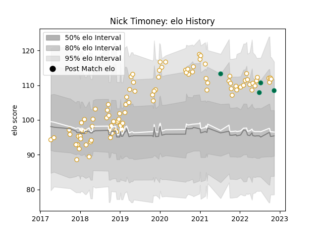

---  
layout: page  
title: Nick Timoney  
date: 2023-01-13 11:30:07.481883  
categories: player  
---
# Nick Timoney

## Positions: N8, FL

## Country: Ireland

## Current elo: 120.0

## Current Percentile: 90.0

# Elo History

# Match History

| Team    |   Appearances |   Win Rate |
|:--------|--------------:|-----------:|
| Ulster  |            99 |   0.631313 |
| Ireland |             5 |   0.8      |

| Opponent                 |   Matches |   Win Rate |
|:-------------------------|----------:|-----------:|
| Leinster                 |        14 |   0.285714 |
| Munster                  |        10 |   0.55     |
| Connacht                 |        10 |   0.5      |
| Scarlets                 |         6 |   0.666667 |
| Cardiff Blues            |         6 |   0.75     |
| Ospreys                  |         6 |   0.833333 |
| Dragons                  |         6 |   0.916667 |
| Benetton Treviso         |         5 |   0.7      |
| Edinburgh                |         5 |   0.8      |
| Glasgow Warriors         |         4 |   0.75     |
| Zebre                    |         4 |   0.75     |
| Southern Kings           |         3 |   1        |
| Racing 92                |         2 |   0.5      |
| La Rochelle              |         2 |   0.5      |
| Leicester Tigers         |         2 |   1        |
| Lions                    |         2 |   1        |
| New Zealand Maori        |         2 |   0.5      |
| Cheetahs                 |         2 |   0.75     |
| Harlequins               |         2 |   1        |
| Wasps                    |         1 |   0        |
| United States of America |         1 |   1        |
| Stormers                 |         1 |   0        |
| Stade Toulousain         |         1 |   0        |
| Fiji                     |         1 |   1        |
| Sharks                   |         1 |   1        |
| Bulls                    |         1 |   0        |
| Sale Sharks              |         1 |   0        |
| Clermont Auvergne        |         1 |   1        |
| Bath Rugby               |         1 |   1        |
| Argentina                |         1 |   1        |