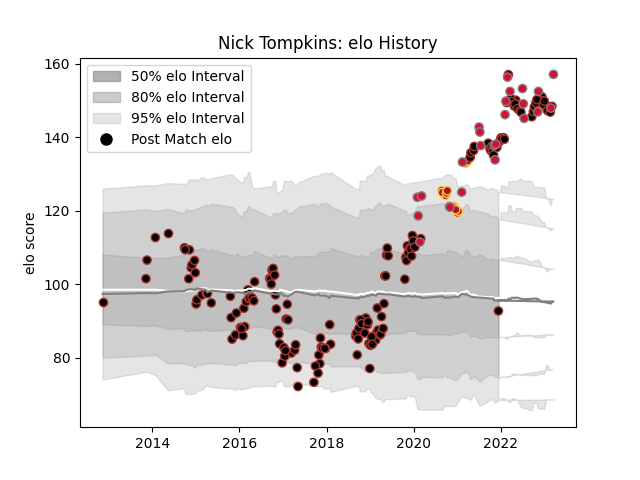

---  
layout: page  
title: Nick Tompkins  
date: 2022-12-14 11:17:19.553462  
categories: player  
---
# Nick Tompkins

## Positions: C

## Country: Wales

## Current elo: 129.0

## Current Percentile: 99.0

# Elo History

# Match History

| Team     |   Appearances |   Win Rate |
|:---------|--------------:|-----------:|
| Saracens |           149 |   0.734899 |
| Wales    |            23 |   0.413043 |
| Dragons  |            11 |   0.409091 |

| Opponent            |   Matches |   Win Rate |
|:--------------------|----------:|-----------:|
| Exeter Chiefs       |        15 |   0.5      |
| Leicester Tigers    |        14 |   0.642857 |
| Harlequins          |        12 |   0.75     |
| Sale Sharks         |        11 |   0.681818 |
| Newcastle Falcons   |        11 |   1        |
| Gloucester Rugby    |        10 |   0.5      |
| Northampton Saints  |         9 |   0.777778 |
| Wasps               |         8 |   0.625    |
| Bristol Rugby       |         8 |   0.75     |
| Worcester Warriors  |         8 |   0.75     |
| London Irish        |         7 |   0.857143 |
| Bath Rugby          |         7 |   0.571429 |
| Scarlets            |         6 |   0.583333 |
| Ospreys             |         5 |   0.7      |
| Glasgow Warriors    |         5 |   1        |
| South Africa        |         4 |   0.25     |
| Scotland            |         3 |   0.666667 |
| Ireland             |         3 |   0.333333 |
| Argentina           |         3 |   0.5      |
| Munster             |         3 |   0.666667 |
| England             |         2 |   0        |
| France              |         2 |   0        |
| Cardiff Blues       |         2 |   1        |
| Edinburgh           |         2 |   1        |
| Leinster            |         2 |   0.5      |
| Racing 92           |         2 |   0.5      |
| Lyon                |         2 |   1        |
| Ulster              |         2 |   0.5      |
| Italy               |         2 |   0.5      |
| Toulon              |         1 |   1        |
| Ampthill            |         1 |   1        |
| New Zealand         |         1 |   0        |
| London Welsh        |         1 |   1        |
| Fiji                |         1 |   1        |
| Ealing Trailfinders |         1 |   1        |
| Dragons             |         1 |   1        |
| Doncaster           |         1 |   1        |
| Coventry            |         1 |   1        |
| Clermont Auvergne   |         1 |   0        |
| Canada              |         1 |   1        |
| Australia           |         1 |   1        |
| Zebre               |         1 |   1        |