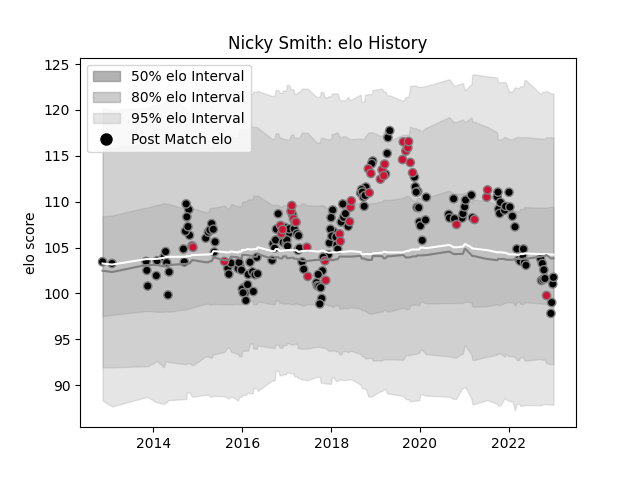

---  
layout: page  
title: Nicky Smith  
date: 2022-12-31 16:26:52.307318  
categories: player  
---
# Nicky Smith

## Positions: P

## Country: Wales

## Current elo: 91.0

## Current Percentile: 18.0

# Elo History

# Match History

| Team    |   Appearances |   Win Rate |
|:--------|--------------:|-----------:|
| Ospreys |           154 |   0.555195 |
| Wales   |            40 |   0.6625   |

| Opponent             |   Matches |   Win Rate |
|:---------------------|----------:|-----------:|
| Dragons              |        16 |   0.71875  |
| Cardiff Blues        |        15 |   0.733333 |
| Munster              |        13 |   0.307692 |
| Scarlets             |        12 |   0.375    |
| Ulster               |        10 |   0.2      |
| Zebre                |         9 |   0.888889 |
| Edinburgh            |         8 |   0.875    |
| Leinster             |         8 |   0.25     |
| Benetton Treviso     |         8 |   0.75     |
| Connacht             |         7 |   0.714286 |
| Glasgow Warriors     |         6 |   0.416667 |
| Cheetahs             |         5 |   0.6      |
| France               |         4 |   0.25     |
| Australia            |         4 |   0.5      |
| Ireland              |         4 |   0.5      |
| Argentina            |         4 |   0.875    |
| England              |         4 |   0.5      |
| Scotland             |         3 |   0.666667 |
| Northampton Saints   |         3 |   0.666667 |
| South Africa         |         3 |   1        |
| Italy                |         3 |   1        |
| Saracens             |         3 |   0.166667 |
| New Zealand          |         3 |   0        |
| Clermont Auvergne    |         3 |   0.333333 |
| Lyon                 |         2 |   1        |
| Stormers             |         2 |   0.25     |
| Stade Francais Paris |         2 |   0.5      |
| Southern Kings       |         2 |   1        |
| Lions                |         2 |   0        |
| Racing 92            |         2 |   0        |
| Leicester Tigers     |         2 |   0        |
| Grenoble             |         2 |   1        |
| Exeter Chiefs        |         2 |   0        |
| Georgia              |         2 |   1        |
| Fiji                 |         1 |   1        |
| Sharks               |         1 |   0        |
| Castres Olympique    |         1 |   1        |
| Uruguay              |         1 |   1        |
| Worcester Warriors   |         1 |   1        |
| Tonga                |         1 |   1        |
| Pau                  |         1 |   1        |
| Bordeaux Begles      |         1 |   1        |
| Samoa                |         1 |   1        |
| Sale Sharks          |         1 |   1        |
| Newcastle Falcons    |         1 |   1        |
| Montpellier Herault  |         1 |   1        |
| Canada               |         1 |   1        |
| Japan                |         1 |   1        |
| Gloucester Rugby     |         1 |   1        |
| Bulls                |         1 |   0        |