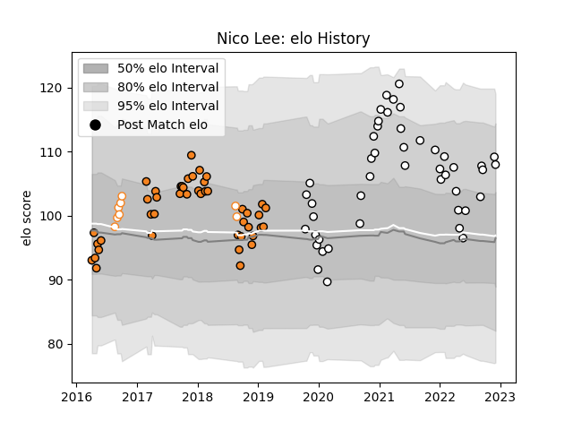

---  
layout: page  
title: Nico Lee  
date: 2022-12-18 16:16:12.802748  
categories: player  
---
# Nico Lee

## Positions: C

## Current elo: 105.0

## Current Percentile: 82.0

# Elo History

# Match History

| Team                |   Appearances |   Win Rate |
|:--------------------|--------------:|-----------:|
| Brive               |            47 |   0.393617 |
| Cheetahs            |            44 |   0.420455 |
| Free State Cheetahs |             8 |   0.75     |

| Opponent                 |   Matches |   Win Rate |
|:-------------------------|----------:|-----------:|
| Zebre                    |         5 |   1        |
| Southern Kings           |         5 |   1        |
| Bordeaux Begles          |         5 |   0.4      |
| Connacht                 |         5 |   0.2      |
| Lyon                     |         5 |   0.4      |
| Racing 92                |         4 |   0        |
| Castres Olympique        |         4 |   0.5      |
| Glasgow Warriors         |         3 |   0        |
| Stade Francais Paris     |         3 |   0.666667 |
| Perpignan                |         3 |   0.666667 |
| Pau                      |         3 |   0.333333 |
| Ospreys                  |         3 |   0.333333 |
| Montpellier Herault      |         3 |   0.333333 |
| Bayonne                  |         3 |   0.5      |
| La Rochelle              |         3 |   0.333333 |
| Agen                     |         3 |   0.666667 |
| Cardiff Blues            |         3 |   0.333333 |
| Bulls                    |         3 |   0.333333 |
| Edinburgh                |         2 |   0.5      |
| Western Province         |         2 |   0.5      |
| Stormers                 |         2 |   0        |
| Benetton Treviso         |         2 |   0.5      |
| Munster                  |         2 |   0        |
| Blue Bulls               |         1 |   0        |
| Ulster                   |         1 |   0.5      |
| Toulon                   |         1 |   0        |
| Sunwolves                |         1 |   1        |
| Stade Toulousain         |         1 |   0        |
| Biarritz Olympique       |         1 |   1        |
| Sharks                   |         1 |   0        |
| Scarlets                 |         1 |   1        |
| Saracens                 |         1 |   0        |
| Pumas                    |         1 |   1        |
| Queensland Reds          |         1 |   0        |
| Golden Lions             |         1 |   1        |
| Bristol Rugby            |         1 |   0        |
| New South Wales Waratahs |         1 |   0        |
| Natal Sharks             |         1 |   1        |
| Chiefs                   |         1 |   0        |
| Clermont Auvergne        |         1 |   0        |
| Crusaders                |         1 |   0        |
| Lions                    |         1 |   0        |
| Leinster                 |         1 |   1        |
| Eastern Province Kings   |         1 |   1        |
| Griquas                  |         1 |   1        |
| Melbourne Rebels         |         1 |   0        |