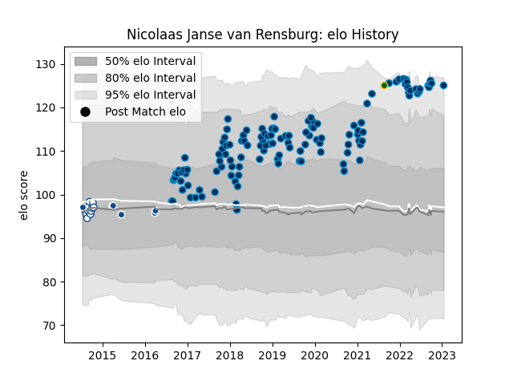

---  
layout: page  
title: Nicolaas Janse van Rensburg  
date: 2023-01-15 11:44:17.972343  
categories: player  
---
# Nicolaas Janse van Rensburg

## Positions: L

## Country: South Africa

## Current elo: 125.0

## Current Percentile: 94.0

# Elo History

# Match History

| Team                |   Appearances |   Win Rate |
|:--------------------|--------------:|-----------:|
| Montpellier Herault |           126 |   0.547619 |
| Blue Bulls          |            11 |   0.545455 |
| Bulls               |             6 |   0.666667 |
| South Africa        |             1 |   1        |

| Opponent               |   Matches |   Win Rate |
|:-----------------------|----------:|-----------:|
| Castres Olympique      |        12 |   0.416667 |
| Stade Toulousain       |        12 |   0.333333 |
| Pau                    |        10 |   0.7      |
| Lyon                   |         9 |   0.333333 |
| Stade Francais Paris   |         8 |   0.625    |
| Racing 92              |         8 |   0.25     |
| La Rochelle            |         8 |   0.5      |
| Toulon                 |         7 |   0.5      |
| Brive                  |         7 |   0.642857 |
| Bordeaux Begles        |         6 |   1        |
| Clermont Auvergne      |         6 |   0.666667 |
| Agen                   |         5 |   0.8      |
| Bayonne                |         4 |   0.75     |
| Perpignan              |         4 |   0.75     |
| Grenoble               |         3 |   0.666667 |
| Leinster               |         3 |   0.333333 |
| Western Province       |         3 |   0        |
| Golden Lions           |         2 |   0.5      |
| Eastern Province Kings |         2 |   1        |
| Glasgow Warriors       |         2 |   1        |
| Biarritz Olympique     |         2 |   1        |
| Exeter Chiefs          |         2 |   0        |
| Cheetahs               |         2 |   0.5      |
| Connacht               |         2 |   0.5      |
| Newcastle Falcons      |         2 |   0.5      |
| Edinburgh              |         2 |   0.5      |
| Sunwolves              |         1 |   1        |
| Crusaders              |         1 |   1        |
| Pumas                  |         1 |   1        |
| Oyonnax                |         1 |   1        |
| Argentina              |         1 |   1        |
| Ospreys                |         1 |   0        |
| Natal Sharks           |         1 |   0        |
| Melbourne Rebels       |         1 |   1        |
| Lions                  |         1 |   0        |
| Free State Cheetahs    |         1 |   1        |
| Griquas                |         1 |   1        |