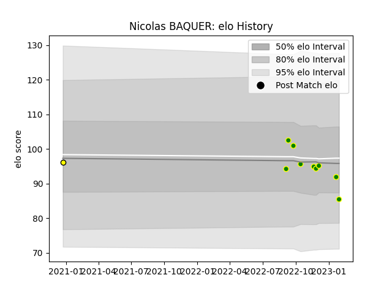

---  
layout: page  
title: Nicolas BAQUER  
date: 2023-03-17 17:34:41.290964  
categories: player  
---
# Nicolas BAQUER

## Positions: FL

## Current elo: 91.0

## Current Percentile: 31.0

# Elo History

# Match History

| Team                |   Appearances |   Win Rate |
|:--------------------|--------------:|-----------:|
| Carqueiranne-Hyères |            10 |        0.1 |
| Carcassonne         |             1 |        1   |

| Opponent                   |   Matches |   Win Rate |
|:---------------------------|----------:|-----------:|
| Valence Romans Drome Rugby |         2 |          0 |
| Albi                       |         1 |          0 |
| Bourgoin-Jallieu           |         1 |          0 |
| Cognac Saint Jean d'Angély |         1 |          1 |
| Dax                        |         1 |          0 |
| Mont-de-Marsan             |         1 |          1 |
| Narbonne                   |         1 |          0 |
| Rennes                     |         1 |          0 |
| Suresnes                   |         1 |          0 |
| US Bressane                |         1 |          0 |