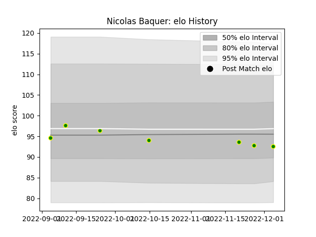

---  
layout: page  
title: Nicolas Baquer  
date: 2022-12-14 11:33:29.835517  
categories: player  
---
# Nicolas Baquer

## Positions: FL

## Current elo: 93.0

## Current Percentile: 43.0

# Elo History

# Match History

| Team                |   Appearances |   Win Rate |
|:--------------------|--------------:|-----------:|
| Carqueiranne-Hyères |             7 |          0 |

| Opponent                   |   Matches |   Win Rate |
|:---------------------------|----------:|-----------:|
| Bourgoin-Jallieu           |         1 |          0 |
| Dax                        |         1 |          0 |
| Narbonne                   |         1 |          0 |
| Rennes                     |         1 |          0 |
| Suresnes                   |         1 |          0 |
| US Bressane                |         1 |          0 |
| Valence Romans Drome Rugby |         1 |          0 |