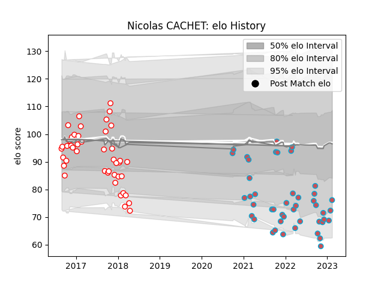

---  
layout: page  
title: Nicolas CACHET  
date: 2023-03-16 11:29:39.238997  
categories: player  
---
# Nicolas CACHET

## Positions: FB, FH

## Current elo: 76.0

## Current Percentile: 6.0

# Elo History

# Match History

| Team             |   Appearances |   Win Rate |
|:-----------------|--------------:|-----------:|
| Bourgoin-Jallieu |            48 |   0.40625  |
| Dax              |            44 |   0.397727 |

| Opponent                   |   Matches |   Win Rate |
|:---------------------------|----------:|-----------:|
| Dax                        |         6 |   0.333333 |
| Narbonne                   |         6 |   0.5      |
| Albi                       |         6 |   0.166667 |
| Tarbes                     |         5 |   0.4      |
| Massy                      |         5 |   0.4      |
| Vannes                     |         4 |   0.75     |
| Biarritz Olympique         |         4 |   0.5      |
| Valence Romans Drome Rugby |         4 |   0.375    |
| Chambery                   |         4 |   0.5      |
| Soyaux-Angouleme           |         4 |   0        |
| Suresnes                   |         3 |   0.666667 |
| Nice                       |         3 |   0.666667 |
| Montauban                  |         3 |   0        |
| Mont-de-Marsan             |         3 |   0        |
| Cognac Saint Jean d'Angély |         3 |   1        |
| Beziers                    |         3 |   0.333333 |
| Aubenas                    |         3 |   0.333333 |
| Perpignan                  |         3 |   0.333333 |
| Colomiers                  |         2 |   1        |
| US Bressane                |         2 |   0        |
| Carcassonne                |         2 |   0        |
| Bourgoin-Jallieu           |         2 |   0.5      |
| Blagnac                    |         2 |   0        |
| Bayonne                    |         2 |   0.25     |
| Aurillac                   |         2 |   1        |
| Agen                       |         1 |   0        |
| Oyonnax                    |         1 |   1        |
| Nevers                     |         1 |   1        |
| Grenoble                   |         1 |   0        |
| Carqueiranne-Hyères        |         1 |   1        |
| Dijon                      |         1 |   0        |